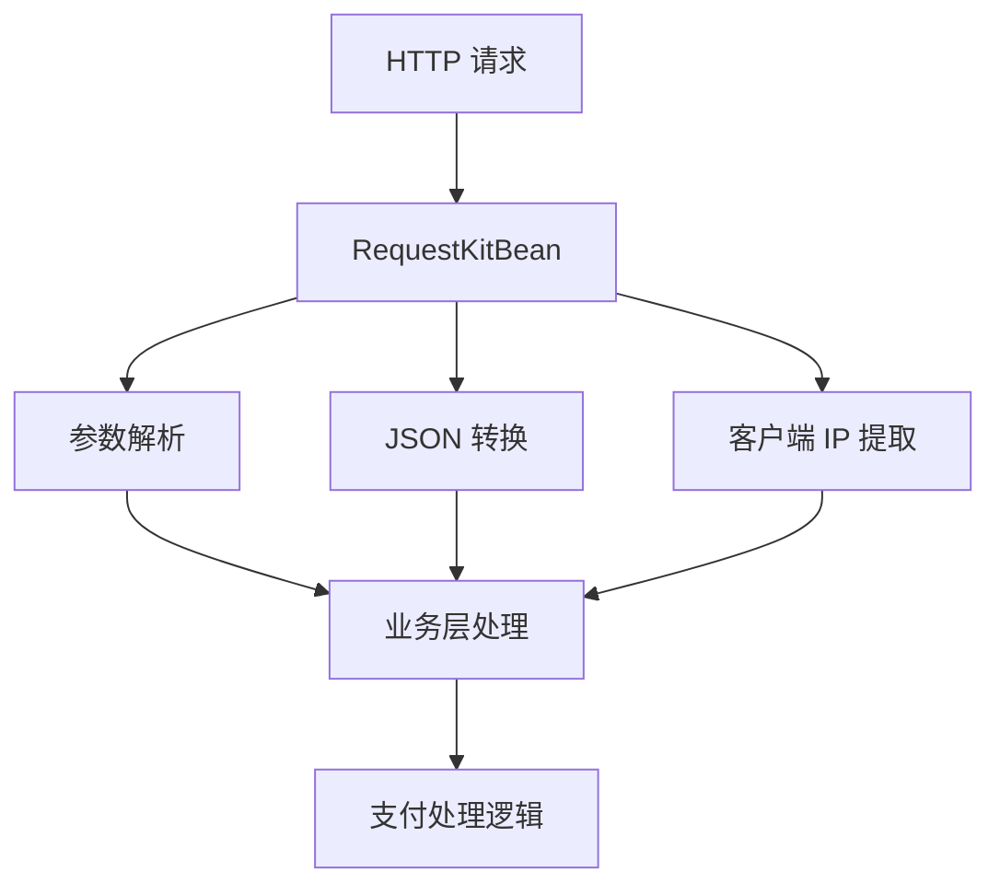

# RequestKitBean.java 类注释完善设计

## 概述

为 Jeepay 支付系统核心模块中的 RequestKitBean.java 类添加完整的中文注释，提升代码可读性和维护性。该类是基于 Spring Framework 的 HTTP 请求处理工具类，负责处理支付系统中各种 HTTP 请求的参数解析、格式转换和客户端信息提取等核心功能。

## 系统架构背景

RequestKitBean 类在 Jeepay 支付系统中的定位：



## 注释设计策略

### 类级注释增强
- 补充类的核心职责说明
- 明确在支付系统中的作用
- 说明线程安全设计原理
- 添加使用示例和注意事项

### 方法级注释完善
针对每个方法添加详细的功能说明、参数描述、返回值说明和异常处理信息

### 关键逻辑注释
对复杂的业务逻辑和技术实现细节添加行内注释，特别是：
- JSON 参数解析逻辑
- 线程安全机制
- 客户端 IP 获取策略
- 请求上下文管理

## 注释内容设计

### 类注释模板
```text
/**
 * HTTP 请求处理工具类
 * 
 * 在 Jeepay 支付系统中负责处理各种 HTTP 请求的参数解析、格式转换和客户端信息提取。
 * 该类采用 Spring 依赖注入机制，自动获取当前请求上下文中的 HttpServletRequest 对象。
 * 
 * 主要功能：
 * 1. 支持多种格式的请求参数解析（JSON、表单参数）
 * 2. 提供线程安全的参数缓存机制
 * 3. 客户端真实 IP 地址获取（支持代理环境）
 * 4. 请求参数到 JSON 对象的自动转换
 * 
 * 线程安全设计：
 * - 使用 Spring RequestContextHolder 进行请求级别的参数缓存
 * - 避免使用实例变量存储请求相关数据
 * - 支持高并发场景下的安全访问
 * 
 * @author terrfly
 * @version 1.0
 * @since 2021/6/7
 */
```

### 核心方法注释设计

#### getReqParamFromBody() 方法
- 功能：从 HTTP 请求体中获取原始参数字符串
- 应用场景：处理 JSON 格式的 POST 请求
- 异常处理：参数转换异常的处理机制

#### reqParam2JSON() 方法  
- 功能：将请求参数转换为 JSON 对象
- 支持格式：JSON 请求体、表单参数、嵌套参数结构
- 特殊处理：数组参数、嵌套对象参数的解析逻辑

#### getReqParamJSON() 方法
- 功能：获取缓存的 JSON 格式请求参数
- 缓存机制：基于 RequestContextHolder 的线程安全缓存
- 性能优化：避免重复解析同一请求的参数

#### getClientIp() 方法
- 功能：获取客户端真实 IP 地址
- 代理支持：处理多层代理的 IP 获取
- 安全考虑：防止 IP 伪造的检测机制

### 内部逻辑注释

#### 线程安全机制
```text
// 注意事项：
// 1. SpringMVC 控制器默认采用单例模式，不可使用实例变量保存请求数据
// 2. 采用线程池模式时，ThreadLocal 可能出现数据残留或覆盖问题
// 3. 使用 RequestContextHolder 确保请求级别的数据隔离
```

#### JSON 解析逻辑
```text
// 支持嵌套参数解析，格式如：ps[abc]=1 转换为 {"ps": {"abc": "1"}}
// 处理数组参数的逗号分隔转换
// 兼容空值和特殊字符的处理
```

#### IP 获取策略
```text
// 按优先级获取客户端 IP：
// 1. x-forwarded-for（代理转发）
// 2. Proxy-Client-IP（Apache 代理）  
// 3. WL-Proxy-Client-IP（WebLogic 代理）
// 4. RemoteAddr（直连）
```

## 代码质量提升

### 常量定义注释
对类中定义的常量添加详细说明，解释其在请求上下文中的作用

### 异常处理注释  
为异常抛出点添加说明，明确异常产生的原因和处理建议

### 算法逻辑注释
对复杂的字符串处理、数组操作等算法逻辑添加步骤说明

## 维护性考虑

### 版本兼容性说明
在注释中说明与不同版本 Spring Framework 的兼容性

### 扩展点标识
标识可能的扩展点和自定义配置项

### 性能注意事项
说明可能影响性能的操作和优化建议

## 文档规范遵循

### JavaDoc 标准
严格遵循 JavaDoc 标准格式，包括：
- @param 参数说明
- @return 返回值说明  
- @throws 异常说明
- @since 版本信息

### 中文注释规范
采用清晰、准确的中文表达，避免英文术语的生硬翻译

### 代码示例
在关键方法注释中提供简单的使用示例，提升理解效率