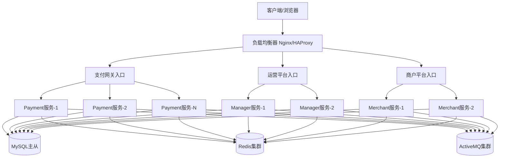
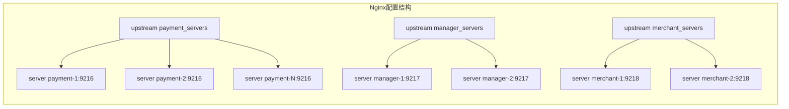
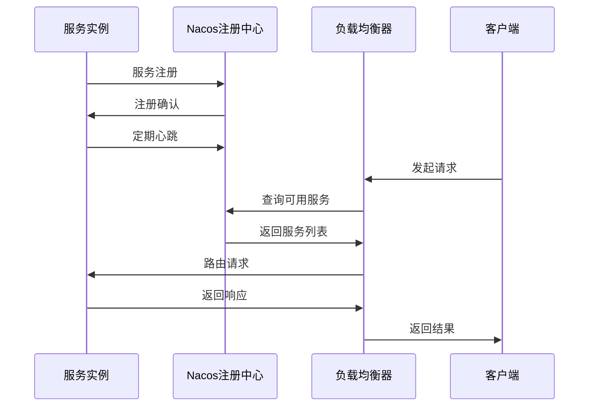
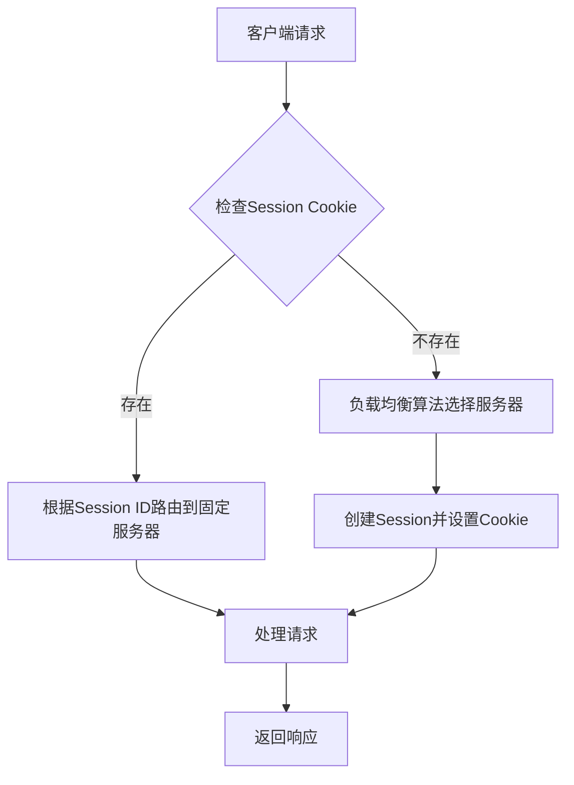
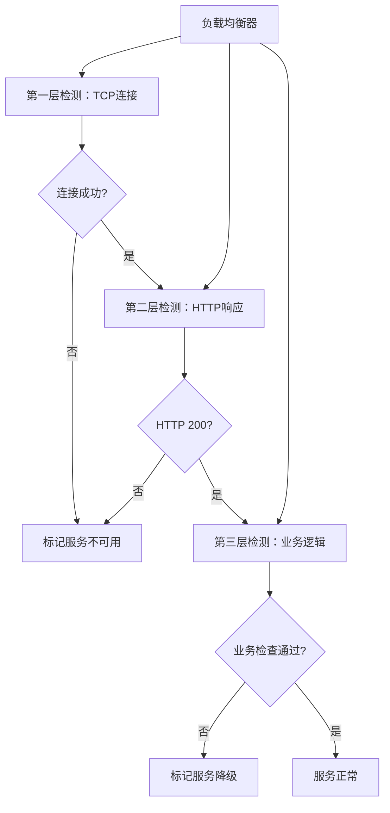
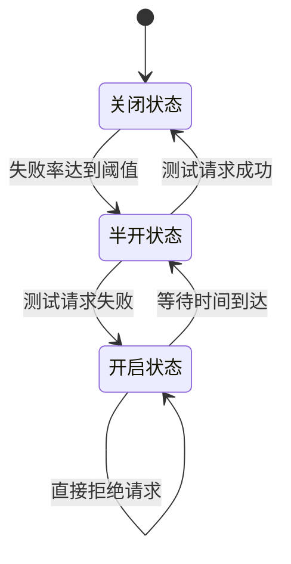
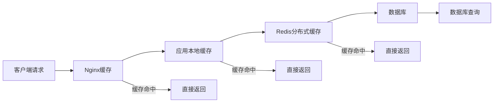
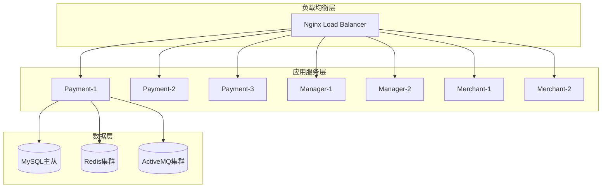
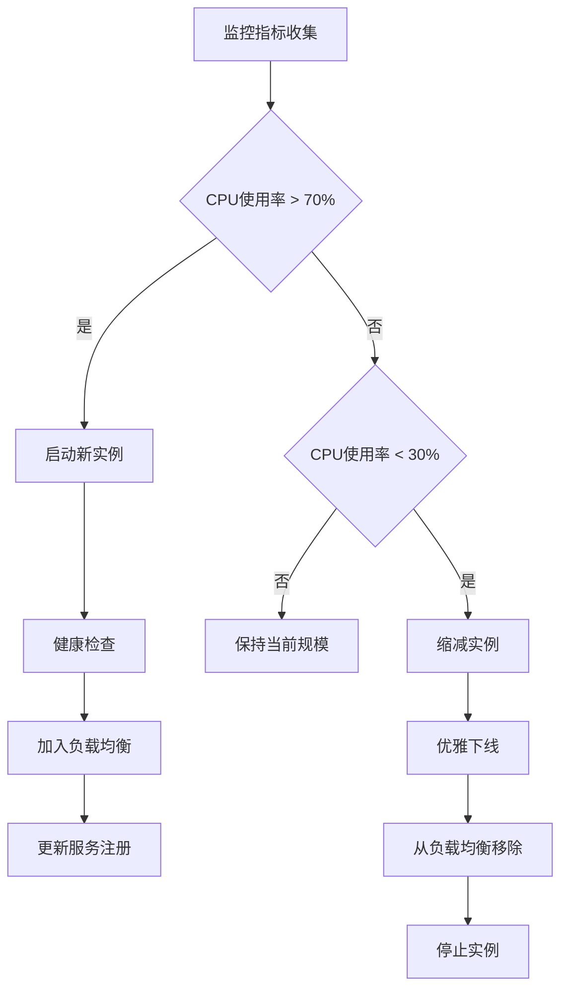

# JeePay支付系统引入LoadBalancer设计方案

## 概述

为JeePay支付系统引入LoadBalancer（负载均衡器）以提升系统的高可用性、扩展性和性能。当前系统采用多模块微服务架构，包含支付网关(payment)、运营平台(manager)和商户平台(merchant)三个核心服务，通过引入负载均衡器，可以实现服务的横向扩展、故障转移和流量分发。

## 当前架构分析

### 服务结构
- **支付网关服务** (jeepay-payment:9216) - 核心支付处理服务
- **运营平台服务** (jeepay-manager:9217) - 系统管理和运营功能
- **商户平台服务** (jeepay-merchant:9218) - 商户管理和自服务功能
- **前端服务** (Vue.js UI) - 分别对应三个后端服务的前端界面

### 基础设施
- MySQL 8.0 数据库
- Redis 缓存
- ActiveMQ 消息队列
- Docker容器化部署

### 现有问题
- 单实例部署，无法处理高并发场景
- 缺乏故障转移机制，单点故障风险高
- 无法进行水平扩展，性能瓶颈明显
- 缺乏统一的入口管理和流量控制

## 负载均衡架构设计

### 整体架构图

### 负载均衡策略

#### 服务级别负载均衡
| 服务类型 | 负载均衡算法 | 权重配置 | 健康检查 |
|---------|------------|---------|---------|
| 支付网关 | 加权轮询 | 根据服务器性能配置 | HTTP GET /actuator/health |
| 运营平台 | 轮询 | 均等权重 | HTTP GET /actuator/health |
| 商户平台 | IP哈希 | 会话粘性 | HTTP GET /actuator/health |

#### 前端静态资源负载均衡
| 资源类型 | 负载均衡算法 | 缓存策略 | 备注 |
|---------|------------|---------|------|
| 静态文件 | 轮询 | 浏览器缓存 + CDN | HTML/CSS/JS |
| API请求 | 加权轮询 | 无缓存 | 后端API调用 |

## 负载均衡器选择与配置

### 选型对比分析

| 特性 | Nginx | HAProxy | Spring Cloud Gateway |
|-----|-------|---------|---------------------|
| 性能 | 极高 | 极高 | 高 |
| 配置复杂度 | 中等 | 中等 | 低 |
| 健康检查 | 基础 | 丰富 | 丰富 |
| 会话保持 | 支持 | 支持 | 支持 |
| SSL终端 | 支持 | 支持 | 支持 |
| 动态配置 | 有限 | 有限 | 完全支持 |

### 推荐方案：Nginx + Spring Cloud LoadBalancer

#### 第一层：Nginx反向代理
负责处理静态资源、SSL终端、基础路由和限流

#### 第二层：Spring Cloud LoadBalancer
在应用层实现服务发现、健康检查和智能路由

### Nginx配置策略

#### 上游服务器组定义

#### 路由规则设计
| 路径模式 | 目标服务 | 负载策略 | 特殊配置 |
|---------|---------|---------|---------|
| /api/pay/* | 支付网关集群 | 加权轮询 | 连接保持、超时优化 |
| /api/manager/* | 运营平台集群 | 轮询 | 会话保持 |
| /api/merchant/* | 商户平台集群 | IP哈希 | 会话保持 |
| /static/* | 静态资源 | 本地文件 | 缓存优化 |

## 服务发现与注册

### 服务注册中心选择

#### 方案对比
| 注册中心 | 优势 | 劣势 | 适用场景 |
|---------|------|------|---------|
| Eureka | Spring生态完整 | 停止更新 | 传统Spring Cloud |
| Consul | 功能全面 | 学习成本高 | 多语言环境 |
| Nacos | 阿里云支持 | 相对较新 | 国内项目 |
| Zookeeper | 稳定可靠 | 运维复杂 | 大规模部署 |

#### 推荐方案：Nacos
基于项目特点和国内使用场景，选择Nacos作为服务注册中心

### 服务注册流程

## 健康检查与监控

### 健康检查机制

#### 检查层级设计
| 检查层级 | 检查内容 | 检查频率 | 失败阈值 |
|---------|---------|---------|---------|
| 基础设施检查 | 服务进程、端口可用性 | 5秒 | 连续3次失败 |
| 应用健康检查 | Spring Boot Actuator | 10秒 | 连续2次失败 |
| 业务功能检查 | 关键接口响应 | 30秒 | 连续1次失败 |
| 依赖服务检查 | 数据库、缓存、MQ | 15秒 | 连续2次失败 |

#### 健康检查接口设计
| 服务 | 检查接口 | 检查内容 | 正常响应 |
|-----|---------|---------|---------|
| 支付网关 | /actuator/health | 数据库连接、Redis连接、MQ连接 | HTTP 200 |
| 运营平台 | /actuator/health | 数据库连接、Redis连接 | HTTP 200 |
| 商户平台 | /actuator/health | 数据库连接、Redis连接 | HTTP 200 |

### 监控指标体系

#### 系统监控指标
- **CPU使用率** - 各服务实例CPU占用情况
- **内存使用率** - JVM堆内存和非堆内存使用情况  
- **网络I/O** - 请求处理速率和响应时间
- **磁盘I/O** - 日志写入和数据存储性能

#### 业务监控指标
- **请求处理量** - QPS/TPS统计
- **响应时间** - 平均响应时间和95%分位数
- **错误率** - 4xx/5xx错误统计
- **支付成功率** - 核心业务指标

#### 负载均衡监控指标
- **后端服务状态** - 健康/不健康实例数量
- **请求分发统计** - 各实例请求分配情况
- **连接池状态** - 活跃连接数和等待队列长度

## 会话管理策略

### 会话保持机制

#### 无状态化改造
为了更好地支持负载均衡，需要对现有服务进行无状态化改造：

| 状态类型 | 当前存储 | 改造方案 | 实现方式 |
|---------|---------|---------|---------|
| 用户登录状态 | 服务内存 | Redis共享存储 | JWT Token + Redis |
| 临时文件 | 本地文件系统 | 分布式存储 | OSS/NFS |
| 缓存数据 | 本地缓存 | 分布式缓存 | Redis集群 |
| 会话数据 | HttpSession | 外部存储 | Spring Session Redis |

#### 会话粘性策略
对于无法完全无状态化的场景，采用会话粘性策略：

## 配置管理

### 配置中心集成

#### 配置分层管理
| 配置层级 | 配置内容 | 存储位置 | 更新频率 |
|---------|---------|---------|---------|
| 基础配置 | 数据库连接、服务端口 | 本地配置文件 | 很少变更 |
| 环境配置 | Redis地址、MQ地址 | Nacos配置中心 | 偶尔变更 |
| 业务配置 | 支付渠道参数、限流规则 | Nacos配置中心 | 经常变更 |
| 实时配置 | 开关控制、动态参数 | Nacos配置中心 | 实时变更 |

#### 配置动态刷新机制
- **自动刷新** - 监听配置中心变更，自动更新应用配置
- **优雅重启** - 对于需要重启的配置变更，采用优雅重启策略
- **配置回滚** - 支持配置版本管理和快速回滚

### 环境隔离

#### 多环境配置方案
| 环境 | 用途 | 配置特点 | 部署方式 |
|-----|------|---------|---------|
| 开发环境 | 日常开发 | 单实例、简化配置 | Docker Compose |
| 测试环境 | 功能测试 | 多实例、接近生产 | Kubernetes |
| 预生产环境 | 性能测试 | 生产配置、压测数据 | Kubernetes |
| 生产环境 | 线上服务 | 高可用配置、实际数据 | Kubernetes |

## 故障转移机制

### 故障检测机制

#### 多层次故障检测

#### 故障恢复策略
| 故障类型 | 检测方式 | 恢复策略 | 恢复时间 |
|---------|---------|---------|---------|
| 服务实例故障 | 健康检查失败 | 自动摘除，流量转移 | 30秒内 |
| 网络分区 | 连接超时 | 重试机制，降级服务 | 1分钟内 |
| 数据库故障 | 连接异常 | 主从切换 | 5分钟内 |
| 缓存故障 | Redis连接失败 | 降级到数据库查询 | 即时降级 |

### 熔断降级机制

#### 熔断器状态管理

#### 降级策略配置
| 服务 | 降级触发条件 | 降级策略 | 降级响应 |
|-----|------------|---------|---------|
| 支付网关 | 错误率>5% | 拒绝新交易，返回系统维护 | 统一错误页面 |
| 运营平台 | 响应时间>3秒 | 禁用非核心功能 | 功能不可用提示 |
| 商户平台 | 可用实例<50% | 只读模式 | 禁用修改操作 |

## 性能优化

### 连接池优化

#### 数据库连接池配置
| 参数 | 推荐值 | 说明 |
|-----|-------|------|
| 初始连接数 | 10 | 系统启动时建立的连接数 |
| 最大连接数 | 50 | 根据数据库服务器性能调整 |
| 最小空闲连接数 | 5 | 保持的最小空闲连接数 |
| 连接超时时间 | 30秒 | 获取连接的最大等待时间 |
| 连接有效性检测 | 开启 | 定期检测连接可用性 |

#### Redis连接池配置
| 参数 | 推荐值 | 说明 |
|-----|-------|------|
| 最大连接数 | 30 | 根据Redis服务器性能调整 |
| 最大空闲连接数 | 10 | 保持的最大空闲连接数 |
| 最小空闲连接数 | 5 | 保持的最小空闲连接数 |
| 连接超时时间 | 1秒 | Redis连接超时时间 |
| 读取超时时间 | 2秒 | Redis读取操作超时时间 |

### 缓存策略优化

#### 多级缓存架构

#### 缓存策略配置
| 缓存层级 | 缓存内容 | 过期时间 | 更新策略 |
|---------|---------|---------|---------|
| Nginx缓存 | 静态资源 | 24小时 | 版本号更新 |
| 本地缓存 | 热点数据 | 5分钟 | LRU淘汰 |
| Redis缓存 | 业务数据 | 30分钟 | 主动更新 |

### 限流与熔断

#### 限流规则配置
| 限流维度 | 限流算法 | 限流阈值 | 触发动作 |
|---------|---------|---------|---------|
| 全局限流 | 令牌桶 | 1000 QPS | 返回限流错误 |
| 用户限流 | 滑动窗口 | 10 QPS/用户 | 返回频率限制 |
| IP限流 | 固定窗口 | 100 QPS/IP | 临时封禁 |
| 接口限流 | 漏桶算法 | 根据接口重要性 | 排队或拒绝 |

## 部署与运维

### 容器化部署方案

#### Docker Compose扩展配置

#### 服务实例规划
| 服务类型 | 最小实例数 | 推荐实例数 | 最大实例数 | 扩容策略 |
|---------|-----------|-----------|-----------|---------|
| 支付网关 | 2 | 3 | 10 | CPU > 70% |
| 运营平台 | 2 | 2 | 5 | 内存 > 80% |
| 商户平台 | 2 | 2 | 5 | 并发数 > 100 |

### 自动化运维

#### 监控告警体系
| 监控项 | 告警阈值 | 告警级别 | 处理方式 |
|-------|---------|---------|---------|
| 服务可用性 | 可用率 < 99% | 紧急 | 立即通知 |
| 响应时间 | 平均响应 > 2秒 | 警告 | 邮件通知 |
| 错误率 | 错误率 > 1% | 严重 | 短信+邮件 |
| 资源使用 | CPU/内存 > 80% | 警告 | 邮件通知 |

#### 自动扩缩容策略

## 测试策略

### 压力测试

#### 测试场景设计
| 测试场景 | 并发用户数 | 持续时间 | 测试目标 |
|---------|-----------|---------|---------|
| 正常负载 | 100 | 30分钟 | 验证基础性能 |
| 峰值负载 | 500 | 10分钟 | 验证扩容能力 |
| 极限负载 | 1000 | 5分钟 | 验证限流熔断 |
| 长时间负载 | 200 | 2小时 | 验证稳定性 |

#### 性能基准指标
| 指标类型 | 目标值 | 备注 |
|---------|-------|------|
| 平均响应时间 | < 500ms | 正常业务请求 |
| 95%响应时间 | < 1000ms | 95%的请求响应时间 |
| 系统吞吐量 | > 1000 TPS | 每秒事务处理数 |
| 错误率 | < 0.1% | 4xx/5xx错误率 |
| 系统可用性 | > 99.9% | 系统正常运行时间比例 |

### 故障测试

#### 混沌工程实施
| 故障类型 | 注入方式 | 预期行为 | 验证指标 |
|---------|---------|---------|---------|
| 服务实例故障 | 随机停止容器 | 自动摘除，流量转移 | 可用性不受影响 |
| 网络延迟 | 注入网络延迟 | 触发超时重试 | 响应时间增加但不超阈值 |
| 数据库故障 | 模拟数据库连接失败 | 启用熔断器 | 降级响应正常 |
| 缓存故障 | 停止Redis服务 | 降级到数据库查询 | 性能下降但功能正常 |

## 安全考虑

### 网络安全

#### 安全防护策略
| 防护层面 | 防护措施 | 实现方式 |
|---------|---------|---------|
| 网络层 | 防火墙规则 | iptables/云安全组 |
| 传输层 | SSL/TLS加密 | Nginx SSL终端 |
| 应用层 | API限流 | 令牌桶算法 |
| 数据层 | 访问控制 | 数据库权限管理 |

#### DDoS防护
- **连接数限制** - 限制单IP并发连接数
- **请求频率限制** - 基于IP和用户的请求频率控制
- **异常流量检测** - 自动检测和拦截异常流量模式
- **黑白名单机制** - 支持IP黑白名单配置

### 数据安全

#### 敏感数据保护
| 数据类型 | 保护措施 | 实现方式 |
|---------|---------|---------|
| 用户密码 | 哈希加盐存储 | BCrypt算法 |
| 支付信息 | 加密存储 | AES-256加密 |
| 通信数据 | 传输加密 | HTTPS/TLS |
| 日志数据 | 脱敏处理 | 敏感信息掩码 |

## 测试

### 单元测试扩展

#### 负载均衡器测试
- **路由规则测试** - 验证请求正确路由到目标服务
- **健康检查测试** - 验证健康检查机制正常工作  
- **故障转移测试** - 验证服务故障时的自动切换
- **会话保持测试** - 验证会话粘性策略正确执行

#### 集成测试增强
- **多实例集成测试** - 验证多服务实例间的协作
- **缓存一致性测试** - 验证分布式缓存的数据一致性
- **消息队列集成测试** - 验证MQ在负载均衡环境下的正常工作
- **数据库连接池测试** - 验证高并发下的数据库连接管理