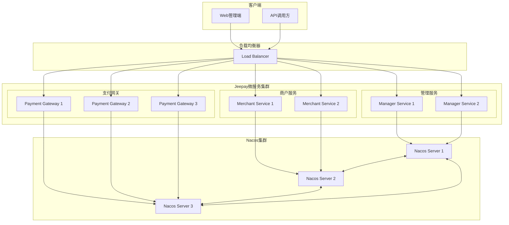
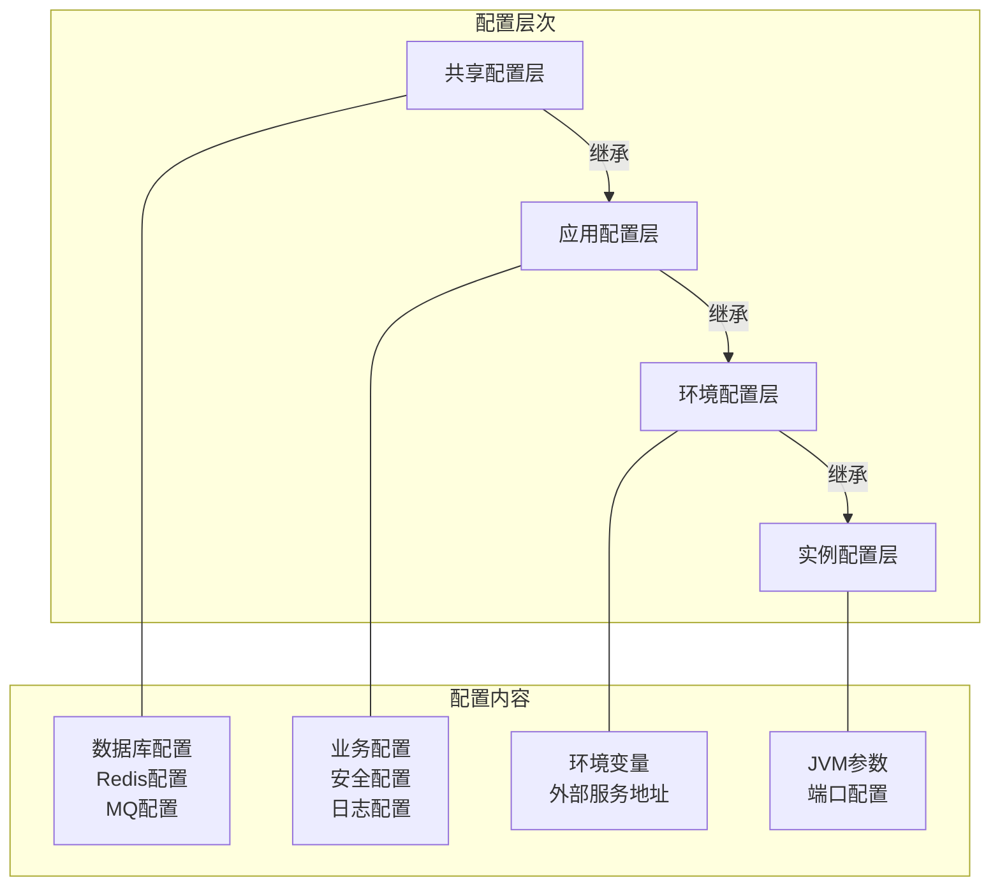
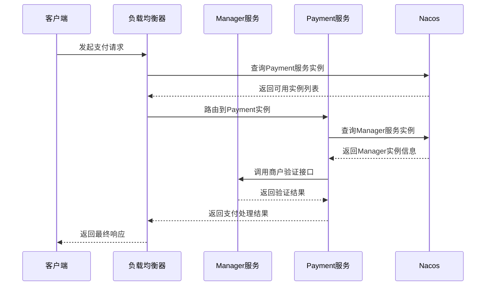
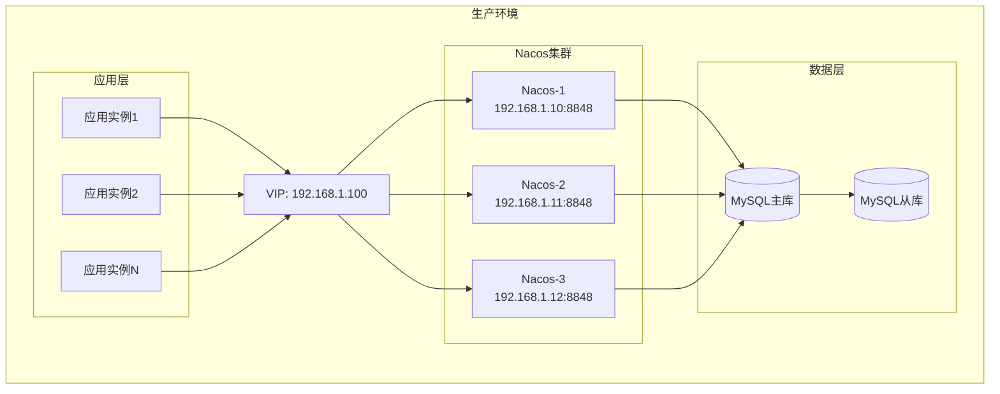
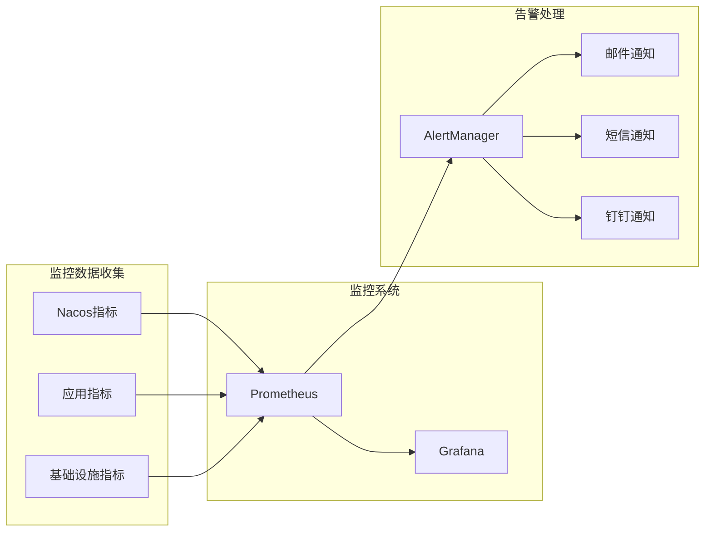
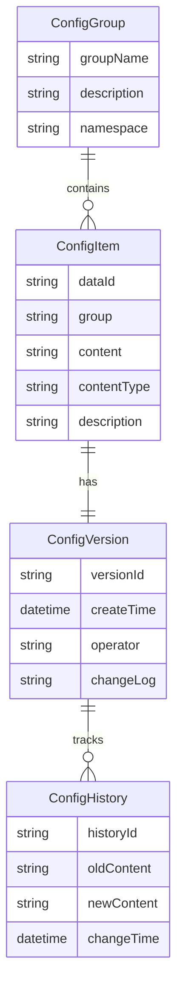
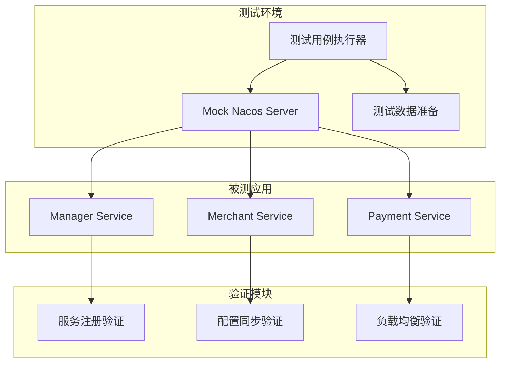

# Jeepay系统引入Nacos注册中心和配置中心设计方案

## 概述

本设计方案旨在为Jeepay支付系统引入Nacos作为微服务注册中心和配置中心，以实现微服务架构的服务发现、负载均衡、配置集中管理和动态配置更新功能。

### 设计目标

- 将当前的单体/模块化架构向微服务架构演进
- 实现服务自动注册与发现机制
- 集中管理所有微服务的配置信息
- 支持配置的动态更新，无需重启服务
- 提供服务健康检查和故障隔离能力
- 增强系统的可扩展性和可维护性

### 技术价值

- **服务解耦**：各微服务间通过服务名进行调用，减少硬编码依赖
- **动态扩缩容**：支持服务实例的动态增减，提升系统弹性
- **配置统一管理**：避免配置分散，提升运维效率
- **环境隔离**：支持多环境配置管理（开发、测试、生产）

## 系统架构设计

### 当前架构分析

Jeepay系统目前包含以下主要模块：
- **jeepay-manager**：运营平台管理端（端口9217）
- **jeepay-merchant**：商户平台管理端
- **jeepay-payment**：统一支付网关
- **jeepay-service**：数据访问服务层
- **jeepay-core**：核心工具类库
- **jeepay-components**：组件库（MQ、OSS等）

### 引入Nacos后的架构设计

### 服务注册与发现设计

#### 服务注册策略

| 服务名称 | 应用名称 | 服务分组 | 命名空间 |
|---------|---------|----------|----------|
| jeepay-manager | manager-service | JEEPAY | dev/test/prod |
| jeepay-merchant | merchant-service | JEEPAY | dev/test/prod |
| jeepay-payment | payment-service | JEEPAY | dev/test/prod |

#### 服务发现机制

- **服务提供者**：启动时自动注册到Nacos注册中心
- **服务消费者**：通过服务名从Nacos获取可用实例列表
- **负载均衡**：支持轮询、随机、加权等负载均衡策略
- **健康检查**：定期检查服务实例健康状态，自动剔除不健康实例

## 配置管理设计

### 配置层次结构

### 配置文件映射表

| 配置类型 | Data ID | Group | 说明 |
|---------|---------|-------|------|
| 数据库配置 | datasource.yml | JEEPAY | 数据库连接配置 |
| Redis配置 | redis.yml | JEEPAY | Redis连接配置 |
| MQ配置 | mq.yml | JEEPAY | 消息队列配置 |
| Manager应用配置 | manager-service.yml | JEEPAY | Manager服务专用配置 |
| Merchant应用配置 | merchant-service.yml | JEEPAY | Merchant服务专用配置 |
| Payment应用配置 | payment-service.yml | JEEPAY | Payment服务专用配置 |
| 安全配置 | security.yml | JEEPAY | JWT、加密等安全配置 |
| 业务配置 | business.yml | JEEPAY | 支付渠道、费率等业务配置 |

### 配置动态更新机制

- **监听器模式**：服务启动时注册配置监听器
- **推送机制**：Nacos配置变更时主动推送到客户端
- **热更新**：支持配置变更后不重启服务即可生效
- **回滚机制**：支持配置版本管理和快速回滚

## 服务间通信设计

### 通信方式选择

| 通信场景 | 通信方式 | 技术方案 |
|---------|---------|----------|
| 同步调用 | HTTP REST | OpenFeign + Ribbon |
| 异步调用 | 消息队列 | ActiveMQ/RabbitMQ |
| 流式数据 | WebSocket | Spring WebSocket |
| 内部调用 | RPC | Dubbo (可选) |

### 服务调用链路设计

## 部署架构设计

### Nacos集群部署方案

#### 集群模式配置

- **节点数量**：3个节点（保证高可用）
- **数据存储**：MySQL数据库（共享存储）
- **网络策略**：内网部署，通过VIP对外提供服务
- **备份策略**：定期备份配置数据和元数据

#### 部署拓扑

### 环境隔离策略

| 环境 | 命名空间 | 集群名称 | 说明 |
|------|----------|----------|------|
| 开发环境 | dev | DEFAULT | 开发人员使用 |
| 测试环境 | test | DEFAULT | 功能测试使用 |
| 预生产环境 | staging | DEFAULT | 生产前验证 |
| 生产环境 | prod | DEFAULT | 线上正式环境 |

## 安全与监控设计

### 安全策略

#### 访问控制
- **身份认证**：Nacos控制台登录认证
- **权限管理**：基于角色的配置权限控制
- **网络安全**：内网访问，防火墙策略
- **数据加密**：敏感配置信息加密存储

#### 配置安全
- **敏感信息加密**：数据库密码、第三方密钥等加密存储
- **配置审计**：记录配置变更历史和操作人员
- **权限分离**：不同环境配置独立管理权限

### 监控告警设计

#### 监控指标

| 监控类型 | 监控指标 | 告警阈值 |
|---------|---------|----------|
| 服务健康 | 服务实例数量 | 少于最小实例数 |
| 服务健康 | 健康检查失败率 | >10% |
| 配置中心 | 配置推送延迟 | >5秒 |
| 配置中心 | 配置变更频率 | 异常频繁 |
| 网络通信 | 服务调用成功率 | <95% |
| 网络通信 | 平均响应时间 | >3秒 |

#### 告警机制

## 数据模型与API设计

### Nacos配置数据模型

#### 核心实体模型

| 实体名称 | 属性 | 说明 |
|---------|------|------|
| ConfigInfo | dataId, group, tenant, content, md5 | 配置信息 |
| ServiceInfo | serviceName, groupName, clusters | 服务信息 |
| Instance | ip, port, weight, healthy, metadata | 服务实例 |

#### 配置结构设计

### 服务注册API接口

#### 核心API接口定义

| 接口功能 | HTTP方法 | 接口路径 | 说明 |
|---------|----------|----------|------|
| 服务注册 | POST | /nacos/v1/ns/instance | 注册服务实例 |
| 服务注销 | DELETE | /nacos/v1/ns/instance | 注销服务实例 |
| 心跳检测 | PUT | /nacos/v1/ns/instance/beat | 发送心跳 |
| 服务发现 | GET | /nacos/v1/ns/instance/list | 获取服务实例列表 |
| 配置获取 | GET | /nacos/v1/cs/configs | 获取配置信息 |
| 配置发布 | POST | /nacos/v1/cs/configs | 发布配置信息 |

## 迁移策略与实施计划

### 迁移阶段规划

#### 第一阶段：基础设施准备
- 部署Nacos集群环境
- 配置网络和安全策略
- 建立监控告警机制

#### 第二阶段：配置迁移
- 将现有application.yml配置迁移到Nacos
- 建立配置管理规范
- 验证配置推送功能

#### 第三阶段：服务注册改造
- 改造jeepay-manager服务，支持服务注册
- 改造jeepay-merchant服务
- 改造jeepay-payment服务

#### 第四阶段：服务发现改造
- 实现服务间调用的动态发现
- 替换硬编码的服务地址
- 集成负载均衡功能

#### 第五阶段：全面验证
- 端到端功能测试
- 性能压力测试
- 故障恢复测试

### 风险控制措施

#### 技术风险
- **回滚方案**：保留原有配置文件，支持快速回滚
- **渐进式迁移**：分阶段迁移，降低风险影响面
- **双轨运行**：新旧方案并行运行一段时间

#### 业务风险
- **业务隔离**：测试环境先行验证
- **流量控制**：通过负载均衡控制流量切换
- **监控覆盖**：全程监控业务指标变化

## 单元测试策略

### 测试范围覆盖

#### 服务注册与发现测试
- 服务启动时自动注册功能测试
- 服务关闭时自动注销功能测试
- 服务实例健康检查测试
- 服务发现API调用测试

#### 配置管理测试
- 配置初始化加载测试
- 配置动态更新测试
- 配置回滚功能测试
- 配置加密解密测试

#### 负载均衡测试
- 多实例负载均衡策略测试
- 故障实例自动剔除测试
- 服务权重调整测试

### 测试用例设计

| 测试场景 | 测试用例 | 预期结果 |
|---------|---------|----------|
| 服务注册 | 启动服务实例 | Nacos控制台显示服务实例 |
| 服务发现 | 调用服务发现API | 返回可用实例列表 |
| 配置加载 | 启动时加载配置 | 应用正确读取Nacos配置 |
| 配置更新 | 修改Nacos配置 | 应用自动刷新配置 |
| 健康检查 | 停止服务实例 | Nacos标记实例为不健康 |
| 负载均衡 | 并发调用服务 | 请求均匀分布到各实例 |

### 集成测试框架

通过以上设计方案，Jeepay系统将成功引入Nacos作为注册中心和配置中心，实现微服务架构的核心能力，提升系统的可扩展性、可维护性和运维效率。