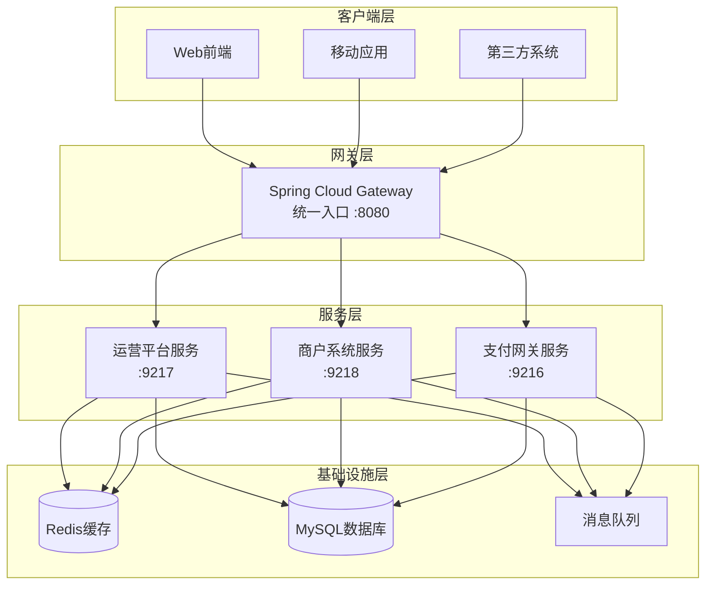
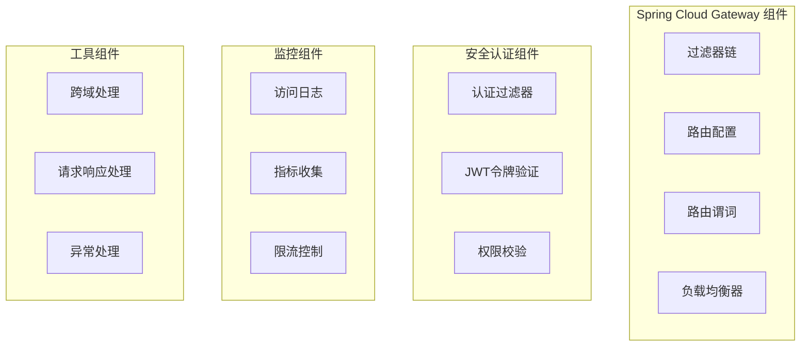
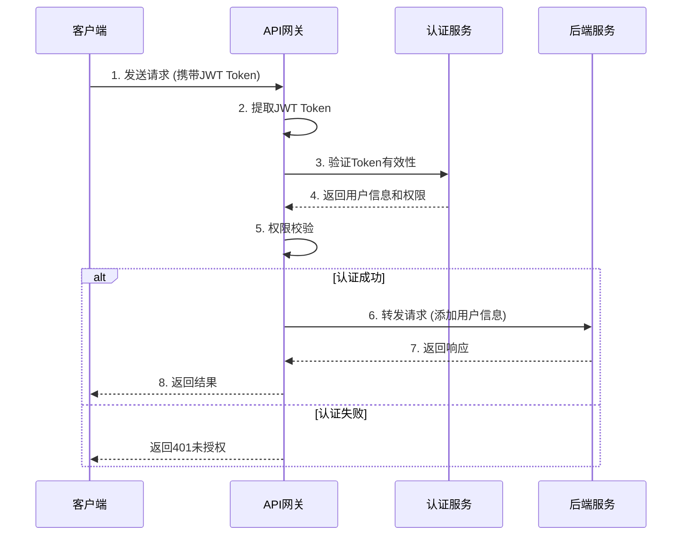
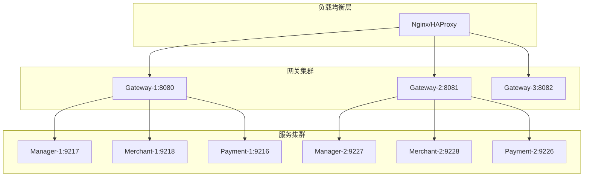

# JeePay 引入 Spring Cloud Gateway 设计方案

## 概述

### 项目背景
JeePay 是一套适合互联网企业使用的开源支付系统，当前采用 Spring Boot 多模块架构，包含三个核心服务模块：
- 运营平台服务（jeepay-manager，端口9217）
- 商户系统服务（jeepay-merchant，端口9218）  
- 支付网关服务（jeepay-payment，端口9216）

### 当前架构痛点
- **服务访问分散**：客户端需要直接访问多个不同端口的服务，增加了系统复杂性
- **跨域处理复杂**：每个服务需要独立处理跨域配置，存在重复配置
- **安全控制分散**：缺乏统一的安全入口，难以实现集中的安全策略
- **负载均衡缺失**：无法对后端服务进行有效的负载均衡和故障转移
- **监控统计困难**：缺乏统一的请求入口，难以进行集中的访问监控和统计

### 引入目标
通过引入 Spring Cloud Gateway 作为统一的 API 网关，实现：
- 统一服务入口，简化客户端访问
- 集中化的安全认证和授权
- 统一的跨域处理和请求/响应处理
- 负载均衡和故障转移能力
- 集中的监控、日志和限流功能

## 技术架构

### 整体架构设计

### Gateway 模块架构

## 路由设计

### 路由规则配置

| 服务模块 | 路由前缀 | 目标服务地址 | 描述 |
|---------|----------|-------------|------|
| 运营平台 | `/api/manager/**` | `http://localhost:9217` | 运营平台管理接口 |
| 商户系统 | `/api/merchant/**` | `http://localhost:9218` | 商户系统管理接口 |
| 支付网关 | `/api/pay/**` | `http://localhost:9216` | 支付相关接口 |
| 静态资源 | `/static/**` | 各服务静态资源 | 静态文件代理 |

### 路由策略

**路径重写规则**
- 请求路径：`/api/manager/sysUser/list` → 后端路径：`/api/sysUser/list`
- 请求路径：`/api/merchant/mchInfo/current` → 后端路径：`/api/mchInfo/current`
- 请求路径：`/api/pay/orders/create` → 后端路径：`/api/orders/create`

**负载均衡策略**
- 初期采用轮询策略，后续可根据实际情况调整为加权轮询或最少连接
- 支持健康检查，自动剔除不健康的服务实例

## 安全设计

### 认证授权流程

### 安全策略

**JWT Token 处理**
- 从请求头 `Authorization: Bearer <token>` 或 Cookie 中提取 JWT
- 验证 Token 签名和有效期
- 解析用户身份和权限信息
- 将用户信息添加到请求头传递给后端服务

**权限控制**
- 基于 URL 路径和 HTTP 方法进行权限校验
- 支持角色基础的访问控制（RBAC）
- 对敏感操作进行额外的权限验证

**安全防护**
- 请求频率限制，防止恶意攻击
- 敏感信息脱敏处理
- SQL 注入和 XSS 攻击防护

## 过滤器设计

### 过滤器链架构

```mermaid
graph LR
    Request[请求] --> GlobalFilter[全局过滤器]
    GlobalFilter --> AuthFilter[认证过滤器]
    AuthFilter --> CorsFilter[跨域过滤器]
    CorsFilter --> LogFilter[日志过滤器]
    LogFilter --> RateLimitFilter[限流过滤器]
    RateLimitFilter --> RouteFilter[路由过滤器]
    RouteFilter --> Backend[后端服务]
    
    Backend --> ResponseFilter[响应过滤器]
    ResponseFilter --> ErrorFilter[异常处理过滤器]
    ErrorFilter --> Response[响应]
```

### 核心过滤器功能

**认证过滤器 (AuthenticationFilter)**
- 负责 JWT Token 的提取和验证
- 用户身份识别和权限解析
- 未认证请求的拦截和处理

**跨域过滤器 (CorsFilter)**
- 统一处理跨域请求
- 支持预检请求 (OPTIONS)
- 配置允许的域名、方法和头部

**日志过滤器 (LoggingFilter)**
- 记录请求和响应信息
- 接口调用统计和监控
- 异常情况的详细日志记录

**限流过滤器 (RateLimitFilter)**
- 基于 Redis 的分布式限流
- 支持按 IP、用户、接口等维度限流
- 提供令牌桶和滑动窗口算法

## 配置管理

### 核心配置参数

| 配置项 | 配置值 | 说明 |
|-------|--------|------|
| `server.port` | `8080` | 网关服务端口 |
| `spring.redis.database` | `0` | Redis 数据库索引 |
| `gateway.routes.manager.uri` | `http://localhost:9217` | 运营平台服务地址 |
| `gateway.routes.merchant.uri` | `http://localhost:9218` | 商户系统服务地址 |
| `gateway.routes.payment.uri` | `http://localhost:9216` | 支付网关服务地址 |
| `gateway.cors.allowed-origins` | `*` | 允许的跨域源 |
| `gateway.rate-limit.default` | `100/min` | 默认限流配置 |

### 路由配置结构

**动态路由配置**
- 支持从配置文件和数据库加载路由规则
- 支持路由的热更新，无需重启服务
- 提供路由配置的版本管理和回滚机制

**健康检查配置**
- 定期检查后端服务健康状态
- 支持自定义健康检查端点
- 异常服务的自动摘除和恢复

## 监控与运维

### 监控指标体系

**性能指标**
- 请求总数和成功率统计
- 平均响应时间和 P99 延迟
- 各服务的调用量分布
- 网关资源使用情况

**业务指标**
- 各业务模块的访问量统计
- 用户活跃度和访问模式分析
- 异常请求和错误率统计
- 安全事件和攻击情况监控

### 日志管理

**日志分类**
- 访问日志：记录所有通过网关的请求
- 错误日志：记录系统异常和业务错误
- 安全日志：记录认证失败和安全事件
- 性能日志：记录性能指标和慢请求

**日志格式规范**
- 统一的结构化日志格式
- 包含请求ID、用户ID、接口路径等关键信息
- 支持日志的检索、分析和告警

## 部署策略

### 部署架构

### 扩展策略

**水平扩展**
- 网关支持多实例部署，通过负载均衡器分发请求
- 后端服务支持集群部署，网关自动发现和负载均衡
- Redis 采用集群模式，提供高可用性和扩展性

**故障恢复**
- 支持熔断机制，防止故障服务影响整体系统
- 提供降级策略，在服务不可用时返回默认响应
- 实现优雅停机，确保正在处理的请求正常完成

## 测试策略

### 功能测试

**路由测试**
- 验证各路由规则的正确性
- 测试路径重写和参数传递
- 验证负载均衡策略的有效性

**安全测试**
- JWT Token 验证测试
- 权限控制测试
- 跨域请求测试
- 限流功能测试

### 性能测试

**压力测试**
- 模拟高并发请求，测试网关的处理能力
- 验证各项性能指标是否满足要求
- 测试极限情况下的系统稳定性

**容错测试**
- 模拟后端服务异常，测试熔断和降级机制
- 验证网关的自我恢复能力
- 测试故障转移的速度和效果