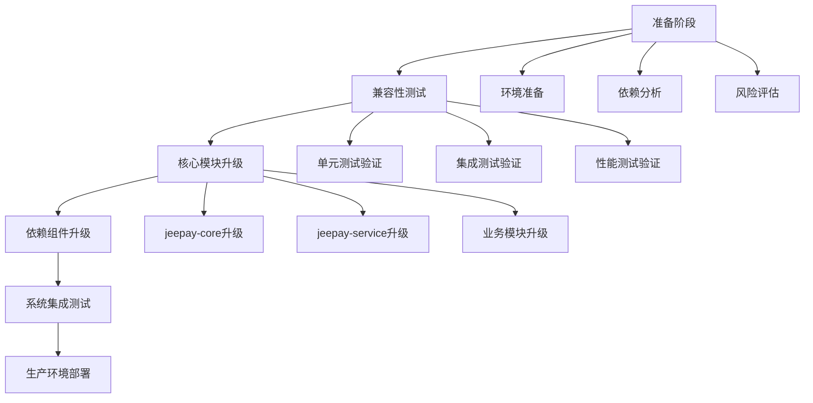
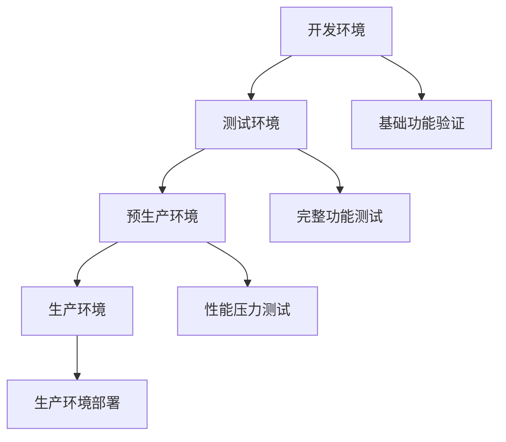
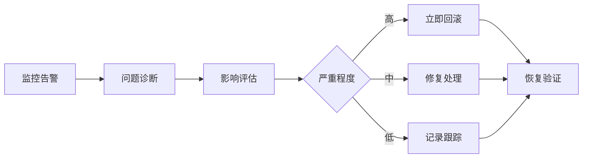
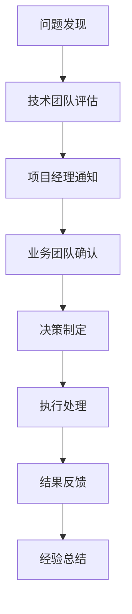

# Jeepay JDK升级到17设计文档

## 概述

本文档描述了将Jeepay支付系统从JDK 8升级到JDK 17的设计方案。Jeepay是一个基于Spring Boot的多模块支付系统，包含运营平台、商户平台、支付网关等核心组件。升级JDK 17将带来更好的性能、安全性和长期支持。

### 升级目标
- 将系统从JDK 8升级到JDK 17 LTS版本
- 确保所有依赖组件与JDK 17兼容
- 保持系统功能完整性和稳定性
- 提升系统性能和安全性

### 技术收益
- **性能提升**: JDK 17提供更高效的垃圾回收器和JIT编译优化
- **安全增强**: 包含多个安全补丁和漏洞修复
- **语言特性**: 支持最新Java语言特性，提升开发效率
- **长期支持**: JDK 17是LTS版本，提供长期技术支持

## 架构影响分析

### 当前架构状态
Jeepay采用微服务架构，包含以下核心模块：

| 模块 | 功能描述 | 当前JDK版本 | 升级风险等级 |
|------|----------|-------------|-------------|
| jeepay-core | 核心工具类和通用组件 | JDK 8 | 低 |
| jeepay-service | 数据库服务层 | JDK 8 | 低 |
| jeepay-manager | 运营平台管理端 | JDK 8 | 中 |
| jeepay-merchant | 商户平台管理端 | JDK 8 | 中 |
| jeepay-payment | 支付统一网关 | JDK 8 | 高 |
| jeepay-components | OSS、MQ组件包 | JDK 8 | 中 |

### 依赖兼容性分析

#### Spring Boot版本兼容性
当前使用Spring Boot 2.4.8，需要评估与JDK 17的兼容性：

| 依赖组件 | 当前版本 | JDK 17兼容状态 | 建议升级版本 |
|----------|----------|----------------|-------------|
| Spring Boot | 2.4.8 | 部分兼容 | 2.7.x或3.0.x |
| MyBatis Plus | 3.4.2 | 兼容 | 保持或升级到3.5.x |
| FastJSON | 1.2.83 | 兼容 | 保持或升级到2.x |
| Hutool | 5.8.26 | 兼容 | 保持 |
| Spring Security | 5.4.7 | 兼容 | 升级到5.7.x |

#### 第三方依赖兼容性评估

| 依赖类别 | 组件名称 | 兼容性状态 | 处理策略 |
|----------|----------|------------|----------|
| 支付SDK | 微信支付SDK | 需验证 | 测试验证兼容性 |
| 支付SDK | 支付宝SDK | 需验证 | 测试验证兼容性 |
| 消息队列 | RocketMQ | 兼容 | 保持当前版本 |
| 数据库 | MySQL驱动 | 兼容 | 保持当前版本 |
| 对象存储 | 阿里云OSS | 兼容 | 保持当前版本 |

## 升级策略设计

### 分阶段升级方案

### 升级优先级策略

#### 第一阶段：基础组件升级
- **目标**: 升级核心基础组件，确保底层兼容性
- **范围**: jeepay-core、jeepay-service模块
- **风险控制**: 重点关注工具类和数据访问层兼容性

#### 第二阶段：业务模块升级
- **目标**: 升级业务逻辑模块
- **范围**: jeepay-manager、jeepay-merchant模块
- **风险控制**: 关注Spring Security和Web层兼容性

#### 第三阶段：核心支付模块升级
- **目标**: 升级支付核心模块
- **范围**: jeepay-payment模块
- **风险控制**: 重点测试第三方支付接口兼容性

#### 第四阶段：组件模块升级
- **目标**: 升级扩展组件
- **范围**: jeepay-components模块
- **风险控制**: 验证OSS和MQ组件功能完整性

## 技术实施方案

### Maven配置调整

#### 根POM配置变更策略
需要调整的关键配置项：

| 配置项 | 当前值 | 目标值 | 影响范围 |
|--------|--------|--------|----------|
| java.version | 1.8 | 17 | 全局编译版本 |
| maven.compiler.source | 1.8 | 17 | 源码兼容性 |
| maven.compiler.target | 1.8 | 17 | 目标字节码版本 |
| spring-boot版本 | 2.4.8 | 2.7.x | 框架兼容性 |

#### 编译插件配置优化
针对JDK 17的编译器特性调整：

| 编译参数 | 配置目的 | 配置值 |
|----------|----------|--------|
| --add-opens | 模块系统开放访问 | 根据运行时需要配置 |
| --add-exports | 导出内部API | 针对特定依赖配置 |
| -XX:+UnlockExperimentalVMOptions | 启用实验性JVM特性 | 性能优化 |

### Docker镜像升级策略

#### 基础镜像变更方案

当前Docker配置分析：
- 基础镜像：openjdk:8u342-jdk
- 目标镜像：openjdk:17-jdk或eclipse-temurin:17-jdk

镜像选择对比：

| 镜像类型 | 优势 | 劣势 | 推荐度 |
|----------|------|------|--------|
| openjdk:17-jdk | 官方支持 | 体积较大 | 高 |
| eclipse-temurin:17-jdk | 优化性能，商业支持 | 相对较新 | 高 |
| amazoncorretto:17 | AWS优化 | 特定环境优化 | 中 |

#### 容器化部署调整

JDK 17容器运行时参数优化：

| 参数类别 | 配置项 | 作用 |
|----------|--------|------|
| 内存管理 | -XX:MaxRAMPercentage=75 | 容器内存使用率优化 |
| 垃圾回收 | -XX:+UseG1GC | 使用G1垃圾回收器 |
| 模块系统 | --add-opens java.base/java.lang=ALL-UNNAMED | 兼容反射访问 |

### 应用配置适配

#### JVM参数调优策略

针对JDK 17的JVM参数优化：

| 参数类型 | 推荐配置 | 说明 |
|----------|----------|------|
| 堆内存 | -Xms2g -Xmx4g | 根据服务器配置调整 |
| 垃圾回收 | -XX:+UseG1GC -XX:MaxGCPauseMillis=200 | G1回收器优化 |
| 模块访问 | --add-opens java.base/java.util=ALL-UNNAMED | 解决反射访问问题 |
| 启动优化 | -XX:+TieredCompilation -XX:TieredStopAtLevel=1 | 快速启动模式 |

#### 应用程序配置调整

Spring Boot配置适配：

| 配置项 | 调整内容 | 原因 |
|--------|----------|------|
| logging.pattern | 调整日志格式 | 适配新的日志特性 |
| management.endpoints | 暴露健康检查端点 | JDK 17监控优化 |
| server.compression | 启用响应压缩 | 性能优化 |

## 测试验证策略

### 兼容性测试方案

#### 单元测试验证
测试覆盖范围：

| 测试类型 | 覆盖模块 | 测试重点 | 通过标准 |
|----------|----------|----------|----------|
| 核心工具类测试 | jeepay-core | 日期、字符串、加密工具 | 100%通过 |
| 数据访问测试 | jeepay-service | MyBatis映射、事务管理 | 100%通过 |
| Web层测试 | 所有Web模块 | 控制器、过滤器、拦截器 | 100%通过 |
| 集成组件测试 | jeepay-components | OSS上传、MQ消息收发 | 100%通过 |

#### 集成测试验证

系统集成测试流程：

测试场景覆盖：

| 测试场景 | 验证内容 | 预期结果 |
|----------|----------|----------|
| 用户登录流程 | JWT生成、Redis存储 | 功能正常 |
| 支付订单创建 | 数据库事务、支付渠道调用 | 数据一致性 |
| 异步消息处理 | MQ消息发送接收 | 消息不丢失 |
| 文件上传下载 | OSS对象存储操作 | 文件完整性 |

#### 性能测试验证

性能基准对比：

| 测试指标 | JDK 8基准 | JDK 17目标 | 测试工具 |
|----------|-----------|-----------|----------|
| 应用启动时间 | 基准值 | 提升10-15% | JMeter |
| 内存使用率 | 基准值 | 降低5-10% | JProfiler |
| 垃圾回收频率 | 基准值 | 降低20% | GCViewer |
| API响应时间 | 基准值 | 保持或提升 | Apache Bench |

### 回滚策略设计

#### 快速回滚方案

回滚决策矩阵：

| 问题严重程度 | 回滚策略 | 回滚时间窗口 | 数据处理 |
|-------------|----------|-------------|----------|
| 严重功能异常 | 立即回滚 | 5分钟内 | 数据回滚 |
| 性能显著下降 | 计划回滚 | 30分钟内 | 数据保留 |
| 兼容性问题 | 分模块回滚 | 1小时内 | 选择性回滚 |

#### 数据一致性保障

回滚过程数据保护措施：

| 数据类型 | 保护策略 | 恢复方案 |
|----------|----------|----------|
| 业务数据 | 实时备份 | 时间点恢复 |
| 配置数据 | 版本控制 | 配置回退 |
| 日志数据 | 归档保存 | 日志分析 |

## 部署实施计划

### 环境部署策略

#### 分环境验证流程

环境升级时间规划：

| 环境类型 | 升级时间窗口 | 验证周期 | 升级策略 |
|----------|-------------|----------|----------|
| 开发环境 | 1天 | 2天 | 并行升级 |
| 测试环境 | 1天 | 5天 | 完整测试 |
| 预生产环境 | 0.5天 | 3天 | 性能验证 |
| 生产环境 | 2小时 | 7天 | 蓝绿部署 |

#### 生产环境部署方案

蓝绿部署实施策略：

| 部署阶段 | 操作内容 | 风险控制 | 监控重点 |
|----------|----------|----------|----------|
| 蓝环境准备 | JDK 17环境搭建 | 环境隔离 | 基础监控 |
| 应用部署 | 新版本应用部署 | 健康检查 | 应用监控 |
| 流量切换 | 逐步切换用户流量 | 实时监控 | 业务监控 |
| 绿环境下线 | 旧版本环境下线 | 备份保留 | 完整监控 |

### 监控告警配置

#### 关键指标监控

升级后重点监控指标：

| 监控类别 | 监控指标 | 告警阈值 | 处理策略 |
|----------|----------|----------|----------|
| 系统性能 | CPU使用率 | >80% | 自动扩容 |
| 内存使用 | 堆内存使用率 | >85% | 内存优化 |
| 垃圾回收 | GC暂停时间 | >500ms | JVM调优 |
| 应用状态 | 响应时间 | >2000ms | 性能排查 |
| 业务指标 | 支付成功率 | <99.5% | 业务检查 |

#### 异常处理机制

异常响应流程：

## 风险控制机制

### 风险识别评估

#### 技术风险评估

| 风险类型 | 风险描述 | 发生概率 | 影响程度 | 应对策略 |
|----------|----------|----------|----------|----------|
| 依赖兼容性 | 第三方库不兼容JDK 17 | 中 | 高 | 预先测试验证 |
| 性能退化 | 升级后性能下降 | 低 | 中 | 性能基准测试 |
| 功能异常 | 业务功能出现问题 | 低 | 高 | 全面回归测试 |
| 部署失败 | 生产环境部署失败 | 低 | 高 | 蓝绿部署策略 |

#### 业务风险评估

业务连续性保障措施：

| 业务场景 | 风险点 | 保障措施 | 应急预案 |
|----------|--------|----------|----------|
| 在线支付 | 支付接口异常 | 多渠道备份 | 手动处理 |
| 用户登录 | 认证服务异常 | 缓存机制 | 降级服务 |
| 数据处理 | 数据丢失风险 | 实时备份 | 数据恢复 |
| 系统监控 | 监控失效 | 多重监控 | 人工巡检 |

### 应急响应预案

#### 快速响应机制

问题响应等级定义：

| 响应等级 | 问题类型 | 响应时间 | 处理团队 |
|----------|----------|----------|----------|
| P0 | 系统全面瘫痪 | 5分钟 | 全体技术团队 |
| P1 | 核心功能异常 | 15分钟 | 核心开发团队 |
| P2 | 部分功能异常 | 1小时 | 相关模块团队 |
| P3 | 性能问题 | 4小时 | 运维团队 |

#### 沟通协调机制

升级期间沟通流程：

## 测试策略

### 单元测试覆盖

#### 核心模块测试重点

| 测试模块 | 测试范围 | 覆盖率要求 | 关键测试点 |
|----------|----------|------------|------------|
| jeepay-core | 工具类、异常处理 | 90% | 加密解密、日期处理 |
| jeepay-service | 数据访问层 | 85% | 事务管理、批量操作 |
| jeepay-payment | 支付核心逻辑 | 95% | 支付流程、状态机 |
| jeepay-manager | 管理后台 | 80% | 权限控制、业务操作 |

#### 兼容性测试验证

JDK特性兼容性测试：

| 测试类型 | 验证内容 | 测试方法 |
|----------|----------|----------|
| 反射机制 | 动态类加载、方法调用 | 自动化测试 |
| 序列化 | 对象序列化兼容性 | 数据对比测试 |
| 并发处理 | 线程池、锁机制 | 压力测试 |
| 网络通信 | HTTP客户端、SSL连接 | 接口测试 |

这是一个全面的JDK升级设计文档，涵盖了从技术分析到实施部署的各个方面。文档重点关注了兼容性、风险控制和分阶段实施策略，确保升级过程的安全性和可控性。