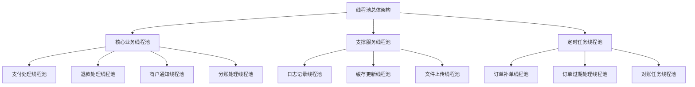
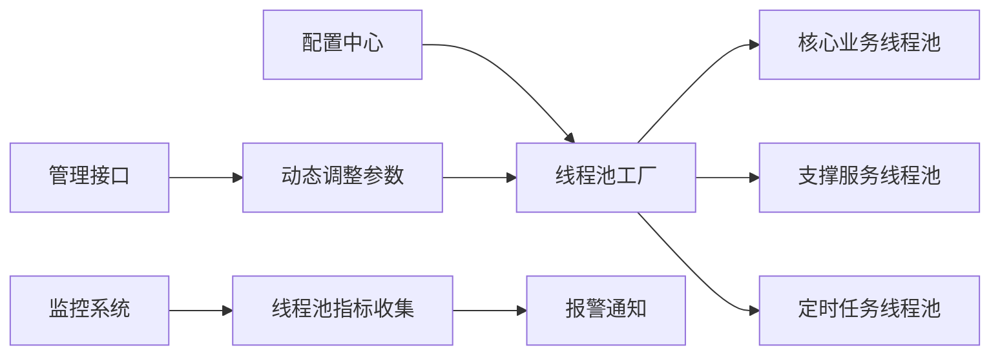
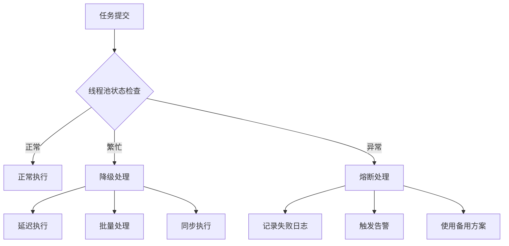

# 线程池配置优化设计

## 概述

JeePay 是一个分布式支付网关系统，采用Spring Boot微服务架构，包含支付网关（jeepay-payment）、运营平台（jeepay-manager）、商户系统（jeepay-merchant）等多个模块。当前系统在异步处理、消息队列消费、定时任务等场景中使用了多种线程池，但配置较为分散且缺乏统一管理。

本设计旨在对核心业务线程池进行合理配置和优化，提升系统的性能、稳定性和可维护性。

## 技术栈

- Spring Boot 2.x
- Spring Task（异步执行）
- ActiveMQ/RabbitMQ/RocketMQ（消息队列）
- Redis（缓存）
- MySQL（数据库）
- Druid（数据库连接池）

## 现状分析

### 当前线程池使用情况

| 应用模块 | 线程池类型 | 配置位置 | 用途 | 核心配置 |
|---------|-----------|----------|------|----------|
| jeepay-components-mq | ThreadPoolTaskExecutor | MqThreadExecutor | 支付结果商户通知 | core:20, max:300, queue:10 |
| jeepay-manager | ScheduledExecutorService | MethodLogAop | 操作日志记录 | 固定线程池:10 |
| jeepay-merchant | ScheduledExecutorService | MethodLogAop | 操作日志记录 | 固定线程池:10 |
| jeepay-payment | @Scheduled | 定时任务类 | 订单补单/过期处理 | 默认单线程执行 |

### 存在的问题

1. **配置分散**: 线程池配置散布在各个模块中，缺乏统一管理
2. **参数硬编码**: 线程池参数直接写死在代码中，无法动态调整
3. **监控缺失**: 缺乏线程池运行状态的监控和报警机制
4. **资源隔离不足**: 不同业务场景共用线程池，可能相互影响
5. **拒绝策略不合理**: 部分场景使用CallerRunsPolicy可能造成阻塞

## 架构设计

### 线程池分类策略

基于业务特性将线程池分为以下类别：

### 配置管理架构

## 详细设计

### 线程池配置标准

#### 核心业务线程池配置

| 线程池名称 | 核心线程数 | 最大线程数 | 队列容量 | 存活时间 | 拒绝策略 | 适用场景 |
|-----------|-----------|-----------|----------|----------|----------|----------|
| paymentProcessPool | 20 | 100 | 200 | 300s | AbortPolicy | 支付处理 |
| refundProcessPool | 10 | 50 | 100 | 300s | CallerRunsPolicy | 退款处理 |
| notifyMerchantPool | 30 | 200 | 50 | 180s | CallerRunsPolicy | 商户通知 |
| divisionProcessPool | 15 | 80 | 150 | 300s | AbortPolicy | 分账处理 |

#### 支撑服务线程池配置

| 线程池名称 | 核心线程数 | 最大线程数 | 队列容量 | 存活时间 | 拒绝策略 | 适用场景 |
|-----------|-----------|-----------|----------|----------|----------|----------|
| logRecordPool | 5 | 20 | 500 | 600s | DiscardPolicy | 日志记录 |
| cacheUpdatePool | 3 | 10 | 100 | 600s | CallerRunsPolicy | 缓存更新 |
| fileUploadPool | 10 | 30 | 50 | 300s | AbortPolicy | 文件上传 |

#### 定时任务线程池配置

| 线程池名称 | 核心线程数 | 适用场景 | 执行周期 |
|-----------|-----------|----------|----------|
| orderReissuePool | 5 | 订单补单 | 每分钟 |
| orderExpiredPool | 3 | 订单过期处理 | 每分钟 |
| reconciliationPool | 2 | 对账任务 | 每小时 |

### 线程池工厂设计

#### 统一线程池工厂

负责创建和管理所有业务线程池，提供统一的配置入口和生命周期管理。

**核心职责**:
- 根据配置参数创建不同类型的线程池
- 提供线程池的统一命名规范
- 支持线程池的动态调整
- 集成监控指标收集

#### 配置参数管理

**参数分层结构**:
- 全局默认参数
- 业务类型参数  
- 具体线程池参数

**配置优先级**: 具体线程池参数 > 业务类型参数 > 全局默认参数

### 监控与告警设计

#### 监控指标

| 指标类型 | 具体指标 | 监控目的 |
|---------|----------|----------|
| 容量指标 | 活跃线程数、队列大小、已完成任务数 | 评估负载情况 |
| 性能指标 | 平均执行时间、任务等待时间 | 分析性能瓶颈 |
| 健康指标 | 拒绝任务数、异常任务数 | 发现问题 |

#### 告警策略

**告警级别**:
- **严重**: 线程池拒绝任务、线程池满载运行超过5分钟
- **警告**: 队列积压超过80%、平均等待时间超过阈值
- **信息**: 线程池扩容/缩容事件

### 动态调整机制

#### 支持调整的参数

- 核心线程数
- 最大线程数  
- 队列容量
- 线程存活时间
- 拒绝策略

#### 调整策略

**自动调整**:
- 基于历史负载数据进行预测性调整
- 根据当前系统资源使用率进行响应式调整

**手动调整**:
- 通过管理接口进行参数调整
- 支持配置文件热更新

### 错误处理与降级

#### 异常处理机制

**线程池异常分类**:
- 任务执行异常：记录日志，不影响其他任务
- 线程池资源异常：触发告警，启动降级策略
- 配置错误异常：回滚到默认配置

#### 降级策略

## 实施方案

### 分阶段实施

#### 第一阶段：基础架构建设
- 创建线程池工厂和配置管理框架
- 实现基础监控指标收集
- 建立配置参数体系

#### 第二阶段：核心业务迁移
- 迁移支付处理、商户通知等核心业务线程池
- 实现动态调整功能
- 建立告警机制

#### 第三阶段：全面优化
- 迁移所有业务线程池
- 实现自动调优功能
- 建立完整的运维体系

### 风险控制

**迁移风险**:
- 分批次迁移，每次只迁移一个业务模块
- 保留原有配置作为备份
- 建立回滚机制

**性能风险**:
- 在测试环境充分验证配置参数
- 监控关键业务指标变化
- 建立性能基线对比

**稳定性风险**:
- 实现熔断机制防止雪崩
- 建立多级降级策略
- 完善监控告警体系

## 测试策略

### 压力测试

**测试场景**:
- 正常负载下的性能表现
- 高并发场景下的稳定性
- 突发流量的处理能力

**测试指标**:
- 响应时间分布
- 系统资源使用率
- 错误率和超时率

### 容灾测试

**测试内容**:
- 线程池满载处理
- 配置错误恢复
- 系统异常降级

### 兼容性测试

**验证内容**:
- 与现有业务的兼容性
- 不同环境下的配置适应性
- 版本升级的平滑性