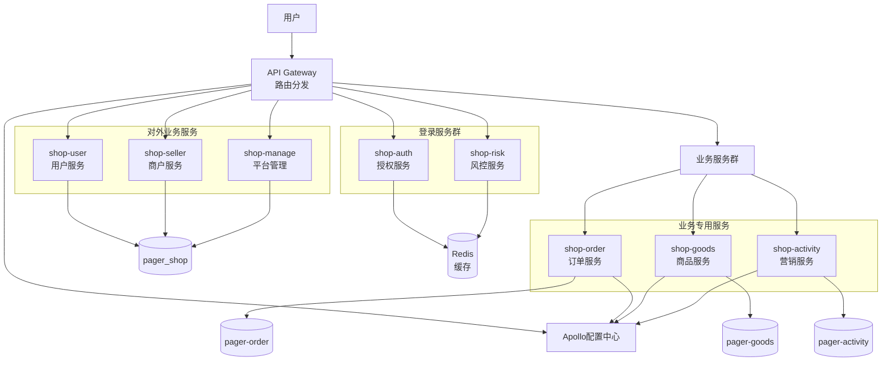
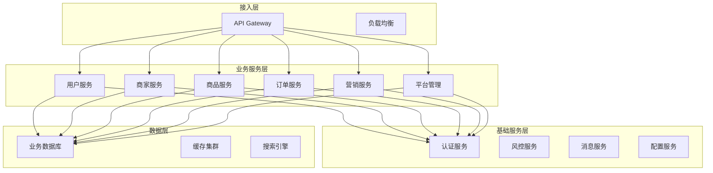
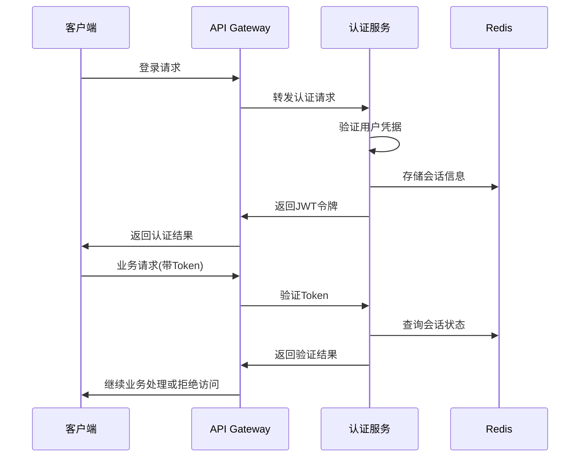
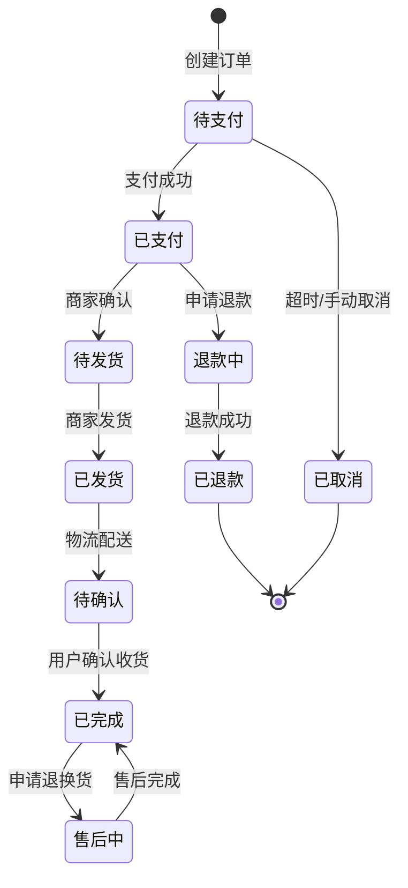
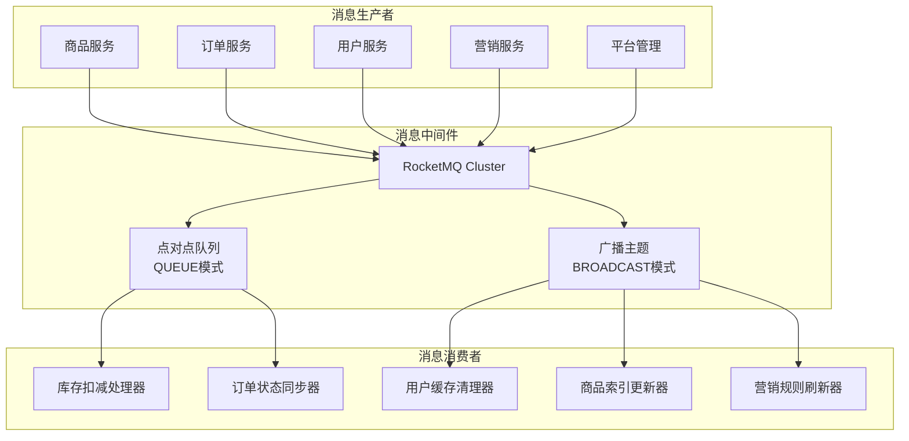
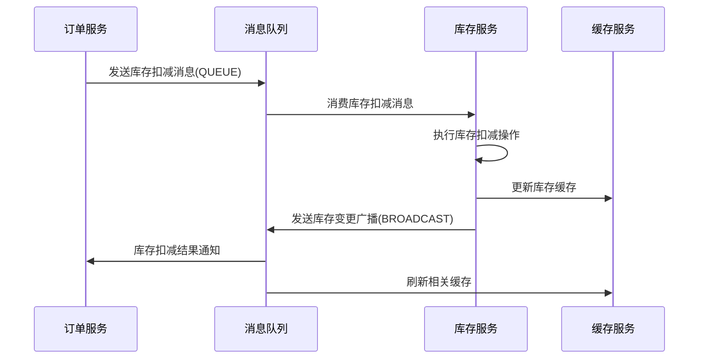
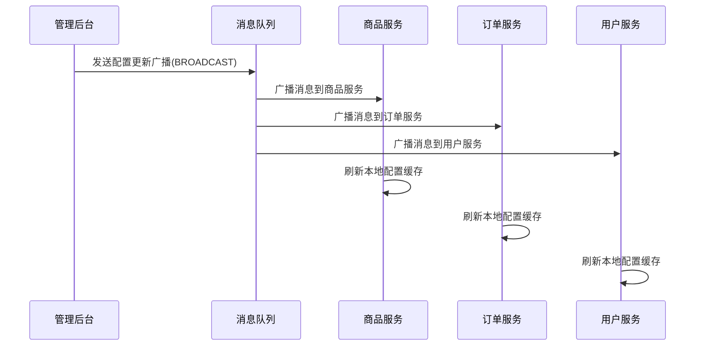
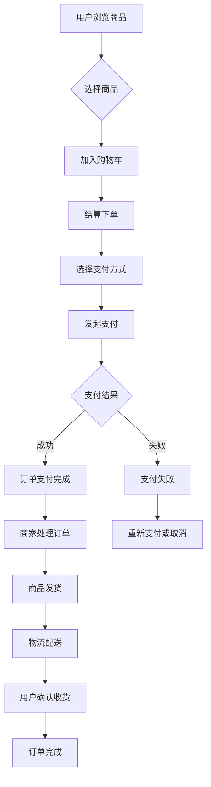
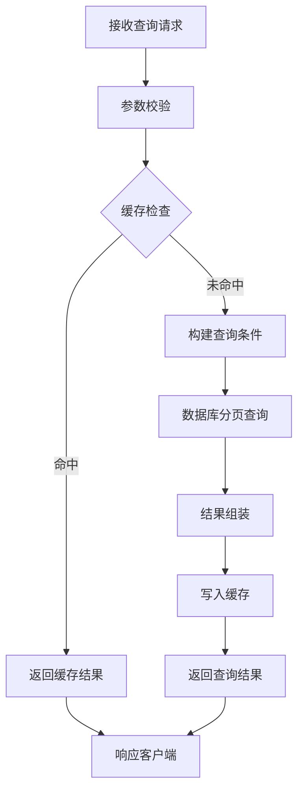

# 分页商城系统架构设计

## 概述

基于jeepay支付系统的技术栈，设计一个支持分页功能的微服务电商平台。该系统采用微服务架构，通过API网关进行统一接入，支持用户管理、商家管理、商品管理、订单处理等核心业务功能，并集成Apollo配置中心进行统一配置管理。

### 核心价值
- 支持大规模商品数据的分页展示和检索
- 提供完整的电商业务流程闭环
- 微服务架构保证系统的可扩展性和高可用性
- 统一的用户认证和权限管理
- 集成支付网关支持多种支付方式

## 技术栈依赖

| 技术组件 | 版本 | 用途 |
|---------|-----|-----|
| Spring Boot | 2.4.5 | 微服务开发框架 |
| Spring Cloud Gateway | 2020.0.x | API网关 |
| MySQL | 8.0+ | 业务数据存储 |
| Redis | 6.0+ | 缓存与会话管理 |
| Apollo | 最新版 | 配置管理中心 |
| RocketMQ | 4.9+ | 消息队列 |
| Feign | 3.0+ | 服务间通信 |

## 系统架构

### 整体架构图



### 服务层次架构



## 核心微服务设计

### 网关服务 (API Gateway)

**职责定义**
- 统一入口管理，处理所有外部请求
- 路由转发与负载均衡
- 全局认证与鉴权
- 请求限流与熔断保护
- 统一响应格式处理

**路由规则**
| 路径模式 | 目标服务 | 描述 |
|---------|---------|-----|
| /api/auth/** | shop-auth | 用户认证相关 |
| /api/user/** | shop-user | 用户服务接口 |
| /api/seller/** | shop-seller | 商家服务接口 |
| /api/goods/** | shop-goods | 商品服务接口 |
| /api/order/** | shop-order | 订单服务接口 |
| /api/activity/** | shop-activity | 营销活动接口 |
| /api/manage/** | shop-manage | 平台管理接口 |

### 认证服务 (shop-auth)

**核心功能**
- 用户注册、登录、登出
- JWT令牌生成与验证
- 用户权限管理
- 单点登录支持

**认证流程**



### 用户服务 (shop-user)

**数据模型**
| 字段名 | 类型 | 描述 | 索引 |
|-------|-----|-----|-----|
| user_id | BIGINT | 用户唯一标识 | PRIMARY |
| username | VARCHAR(50) | 用户名 | UNIQUE |
| email | VARCHAR(100) | 邮箱地址 | INDEX |
| phone | VARCHAR(20) | 手机号码 | UNIQUE |
| avatar_url | VARCHAR(255) | 头像地址 | - |
| status | TINYINT | 用户状态 | INDEX |
| created_time | DATETIME | 创建时间 | INDEX |
| updated_time | DATETIME | 更新时间 | - |

**核心接口**
- 用户信息查询与更新
- 用户收货地址管理
- 用户偏好设置
- 用户行为记录

### 商品服务 (shop-goods)

**分页查询设计**

**查询参数结构**
| 参数名 | 类型 | 必填 | 描述 | 默认值 |
|-------|-----|-----|-----|-------|
| page | Integer | 否 | 页码(从1开始) | 1 |
| size | Integer | 否 | 每页数量 | 20 |
| category_id | Long | 否 | 商品分类ID | - |
| keyword | String | 否 | 搜索关键词 | - |
| price_min | BigDecimal | 否 | 最低价格 | - |
| price_max | BigDecimal | 否 | 最高价格 | - |
| sort_by | String | 否 | 排序字段 | created_time |
| sort_order | String | 否 | 排序方向 | DESC |

**分页响应结构**
| 字段名 | 类型 | 描述 |
|-------|-----|-----|
| content | Array | 当前页商品列表 |
| page | Integer | 当前页码 |
| size | Integer | 每页数量 |
| total_elements | Long | 总记录数 |
| total_pages | Integer | 总页数 |
| first | Boolean | 是否首页 |
| last | Boolean | 是否末页 |

**商品数据模型**
| 字段名 | 类型 | 描述 | 索引 |
|-------|-----|-----|-----|
| goods_id | BIGINT | 商品ID | PRIMARY |
| goods_name | VARCHAR(200) | 商品名称 | FULLTEXT |
| category_id | BIGINT | 分类ID | INDEX |
| seller_id | BIGINT | 商家ID | INDEX |
| price | DECIMAL(10,2) | 商品价格 | INDEX |
| stock | INTEGER | 库存数量 | INDEX |
| sales_count | INTEGER | 销售数量 | INDEX |
| status | TINYINT | 商品状态 | INDEX |
| created_time | DATETIME | 创建时间 | INDEX |

### 订单服务 (shop-order)

**订单状态流转**



**订单数据模型**
| 字段名 | 类型 | 描述 | 索引 |
|-------|-----|-----|-----|
| order_id | BIGINT | 订单ID | PRIMARY |
| order_no | VARCHAR(32) | 订单号 | UNIQUE |
| user_id | BIGINT | 用户ID | INDEX |
| seller_id | BIGINT | 商家ID | INDEX |
| total_amount | DECIMAL(10,2) | 订单金额 | - |
| status | TINYINT | 订单状态 | INDEX |
| payment_status | TINYINT | 支付状态 | INDEX |
| created_time | DATETIME | 创建时间 | INDEX |

### 商家服务 (shop-seller)

**商家信息管理**
- 商家资质认证
- 店铺信息维护
- 商品上架管理
- 订单处理流程
- 财务结算管理

**商家数据模型**
| 字段名 | 类型 | 描述 | 索引 |
|-------|-----|-----|-----|
| seller_id | BIGINT | 商家ID | PRIMARY |
| shop_name | VARCHAR(100) | 店铺名称 | INDEX |
| business_license | VARCHAR(100) | 营业执照号 | UNIQUE |
| contact_person | VARCHAR(50) | 联系人 | - |
| contact_phone | VARCHAR(20) | 联系电话 | - |
| status | TINYINT | 商家状态 | INDEX |
| settlement_rate | DECIMAL(5,4) | 结算费率 | - |

### 营销服务 (shop-activity)

**营销活动类型**
- 优惠券发放与使用
- 限时秒杀活动
- 满减促销
- 积分兑换

**活动数据模型**
| 字段名 | 类型 | 描述 | 索引 |
|-------|-----|-----|-----|
| activity_id | BIGINT | 活动ID | PRIMARY |
| activity_type | TINYINT | 活动类型 | INDEX |
| title | VARCHAR(100) | 活动标题 | - |
| start_time | DATETIME | 开始时间 | INDEX |
| end_time | DATETIME | 结束时间 | INDEX |
| participant_limit | INTEGER | 参与人数限制 | - |
| status | TINYINT | 活动状态 | INDEX |

## API接口规范

### 分页商品查询接口

**请求示例**
```
GET /api/goods/page?page=1&size=20&category_id=123&keyword=手机&sort_by=price&sort_order=ASC
```

**响应示例**
```json
{
  "code": 200,
  "message": "success",
  "data": {
    "content": [
      {
        "goods_id": 1001,
        "goods_name": "iPhone 15 Pro",
        "price": 7999.00,
        "image_url": "https://example.com/images/iphone15pro.jpg",
        "sales_count": 2580
      }
    ],
    "page": 1,
    "size": 20,
    "total_elements": 156,
    "total_pages": 8,
    "first": true,
    "last": false
  }
}
```

### 订单创建接口

**请求示例**
```json
{
  "goods_items": [
    {
      "goods_id": 1001,
      "quantity": 2,
      "price": 7999.00
    }
  ],
  "delivery_address": {
    "receiver_name": "张三",
    "phone": "13800138000",
    "province": "北京市",
    "city": "北京市",
    "district": "朝阳区",
    "detail": "某某街道123号"
  },
  "remark": "请尽快发货"
}
```

## 消息队列设计

### MQ发送类型枚举 (MQSendTypeEnum)

基于jeepay项目的MQ组件设计，系统支持两种消息发送类型：

| 类型 | 枚举值 | 描述 | 适用场景 | 对应MQ模式 |
|------|-------|------|----------|----------|
| 点对点 | QUEUE | 只有1个消费者可消费 | 订单处理、支付通知 | ActiveMQ队列模式 |
| 广播模式 | BROADCAST | 所有接收者都可接收到 | 配置更新、缓存刷新 | ActiveMQ主题模式、RabbitMQ扇出交换机、RocketMQ广播模式 |

### 分页商城消息队列架构



### 商城业务消息定义

**点对点消息 (QUEUE)**

| 消息名称 | MQ_NAME | 用途 | 消息载体 |
|---------|---------|------|--------|
| 商品库存扣减 | QUEUE_GOODS_STOCK_DEDUCT | 订单支付成功后扣减库存 | 商品ID、扣减数量 |
| 订单状态同步 | QUEUE_ORDER_STATUS_SYNC | 订单状态变更同步 | 订单号、状态、时间戳 |
| 支付结果通知 | QUEUE_PAYMENT_NOTIFY | 支付结果通知商家 | 订单号、支付状态、金额 |
| 商品评价处理 | QUEUE_GOODS_REVIEW_PROCESS | 用户评价处理 | 订单号、评价内容、评分 |

**广播消息 (BROADCAST)**

| 消息名称 | MQ_NAME | 用途 | 消息载体 |
|---------|---------|------|--------|
| 商品信息更新 | BROADCAST_GOODS_INFO_UPDATE | 商品信息变更广播 | 商品ID、变更字段 |
| 用户缓存清理 | BROADCAST_USER_CACHE_CLEAN | 用户信息变更清理缓存 | 用户ID列表 |
| 营销活动配置 | BROADCAST_ACTIVITY_CONFIG_UPDATE | 营销活动配置更新 | 活动ID、配置内容 |
| 系统配置刷新 | BROADCAST_SYSTEM_CONFIG_REFRESH | 系统配置参数刷新 | 配置分组、配置键值 |

### 消息发送模式选择策略

**QUEUE模式适用场景**
- 业务处理有严格顺序要求
- 需要保证消息只被处理一次
- 资源消耗型操作（如库存扣减、支付处理）
- 有明确的业务责任方

**BROADCAST模式适用场景**
- 配置信息需要全局同步
- 缓存刷新操作
- 统计数据更新
- 日志记录和监控

### 消息处理流程

**库存扣减消息流程**



**配置更新广播流程**



### 消息重试与异常处理

**重试策略**
| 消息类型 | 重试次数 | 重试间隔 | 失败处理 |
|---------|---------|---------|--------|
| 库存扣减 | 3次 | 30秒递增 | 记录死信，人工处理 |
| 支付通知 | 5次 | 指数退避 | 记录失败日志 |
| 配置更新 | 无限重试 | 固定30秒 | 直到成功 |
| 缓存清理 | 1次 | 无重试 | 忽略失败 |

**异常监控**
- 消息积压告警：队列深度超过1000条
- 消费失败告警：失败率超过5%
- 消费延迟告警：处理时间超过30秒
- 死信队列监控：及时处理死信消息

## 数据库设计

### 主库分表策略

**商品表分片规则**
- 按照 goods_id 进行哈希分片
- 分片数量：16个分片
- 分片算法：goods_id % 16

**订单表分片规则**
- 按照 user_id 进行哈希分片
- 分片数量：32个分片
- 分片算法：user_id % 32

### 缓存策略

**Redis缓存层次**
| 缓存类型 | Key模式 | TTL | 用途 |
|---------|--------|-----|-----|
| 用户会话 | session:{user_id} | 30分钟 | 用户登录状态 |
| 商品信息 | goods:{goods_id} | 1小时 | 商品详情缓存 |
| 商品列表 | goods:list:{hash} | 10分钟 | 分页查询缓存 |
| 库存信息 | stock:{goods_id} | 实时更新 | 商品库存 |
| 热门商品 | hot:goods | 1小时 | 热门商品推荐 |

## 业务流程设计

### 用户购买流程



### 商品分页查询流程



## 配置管理

### Apollo配置中心设计

**配置命名空间**
| 命名空间 | 描述 | 配置示例 |
|---------|-----|---------|
| application | 公共配置 | 数据库连接、Redis配置 |
| shop-goods | 商品服务配置 | 分页大小限制、搜索引擎配置 |
| shop-order | 订单服务配置 | 支付超时时间、库存扣减策略 |
| shop-user | 用户服务配置 | 用户注册限制、头像上传配置 |

**动态配置项**
- 分页查询默认页大小
- 商品搜索结果最大返回数量
- 订单支付超时时间
- 用户会话有效期
- 商品图片上传大小限制

## 监控与运维

### 系统监控指标

**业务监控**
- 分页查询响应时间
- 订单创建成功率
- 支付成功率
- 商品搜索准确率

**技术监控**
- 各微服务健康状态
- 数据库连接池状态
- Redis缓存命中率
- API网关流量分布

**告警策略**
- 服务响应时间超过2秒告警
- 数据库连接数超过80%告警
- 缓存命中率低于90%告警
- 订单支付失败率超过5%告警

### 性能优化策略

**查询优化**
- 商品列表查询使用覆盖索引
- 热门商品数据预加载到缓存
- 分页查询结果缓存策略
- 数据库读写分离

**并发优化**
- 库存扣减使用分布式锁
- 订单号生成使用雪花算法
- 用户会话使用Redis集群
- 静态资源CDN加速

## 安全设计

### 接口安全

**认证机制**
- JWT令牌认证
- 接口签名验证
- IP白名单控制
- 请求频率限制

**数据安全**
- 敏感数据加密存储
- 用户密码BCrypt加密
- 支付信息脱敏处理
- 数据库访问权限控制

**系统安全**
- SQL注入防护
- XSS攻击防护
- CSRF防护机制
- 接口访问日志记录

## 测试策略

### 单元测试

**测试覆盖范围**
- 核心业务逻辑方法
- 数据访问层方法
- 工具类方法
- 异常处理逻辑

**测试工具**
- JUnit 5 单元测试框架
- Mockito 模拟对象
- TestContainers 集成测试
- AssertJ 断言库

### 集成测试

**测试场景**
- 用户注册登录流程
- 商品分页查询功能
- 订单创建支付流程
- 商家商品管理功能

**性能测试**
- 分页查询并发性能测试
- 订单创建压力测试
- 支付接口稳定性测试
- 缓存击穿场景测试