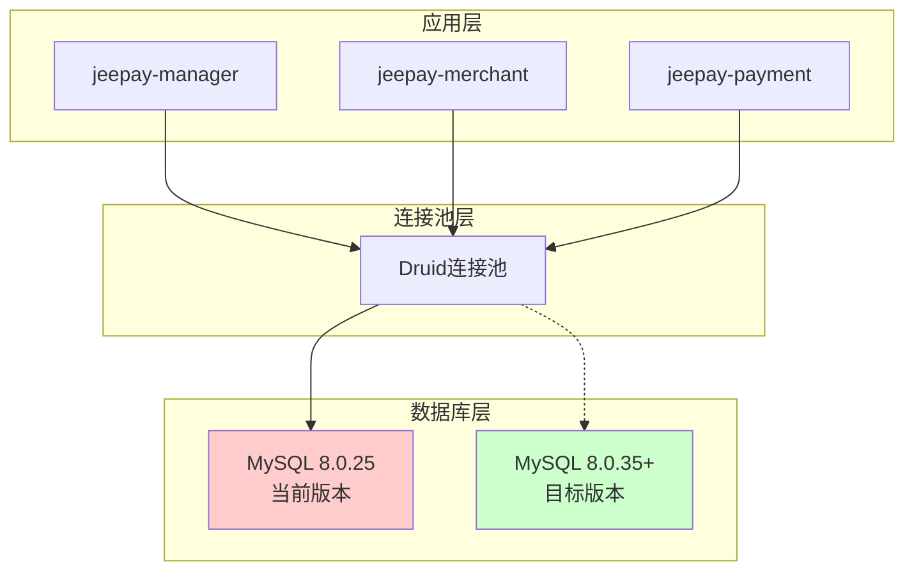
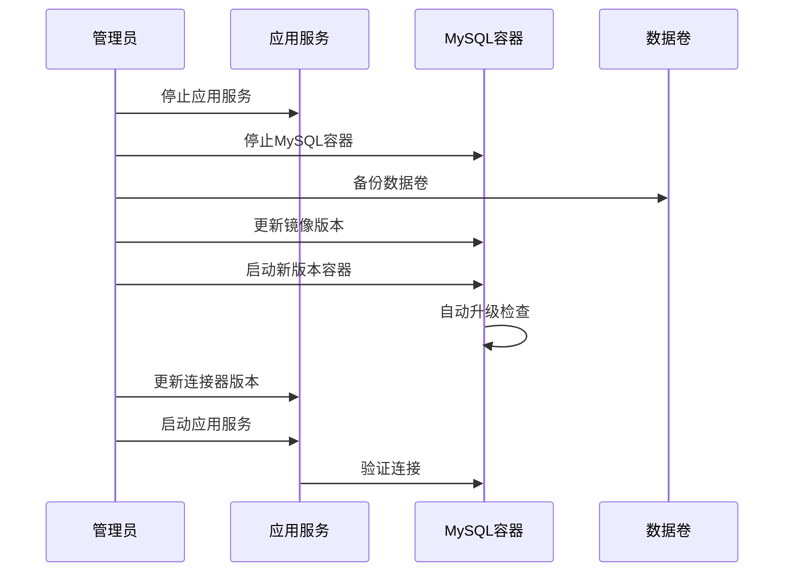
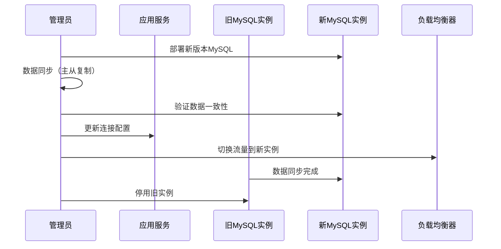
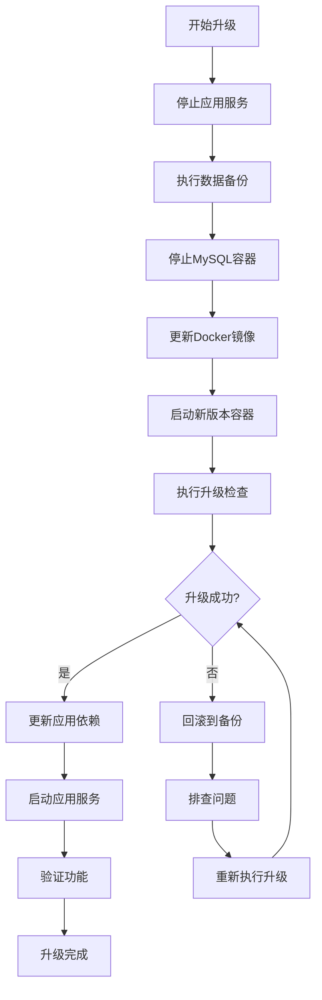
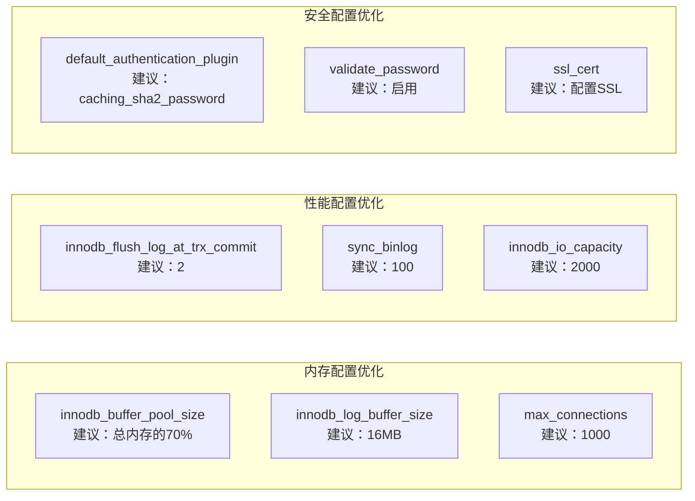
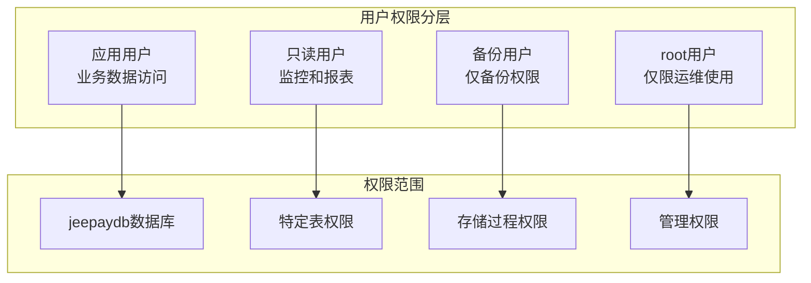
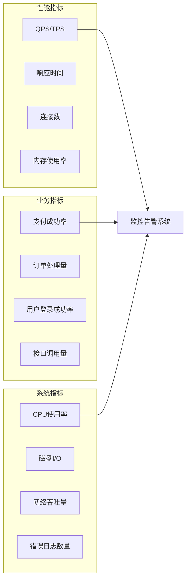
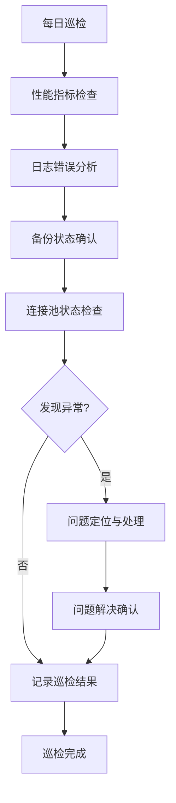
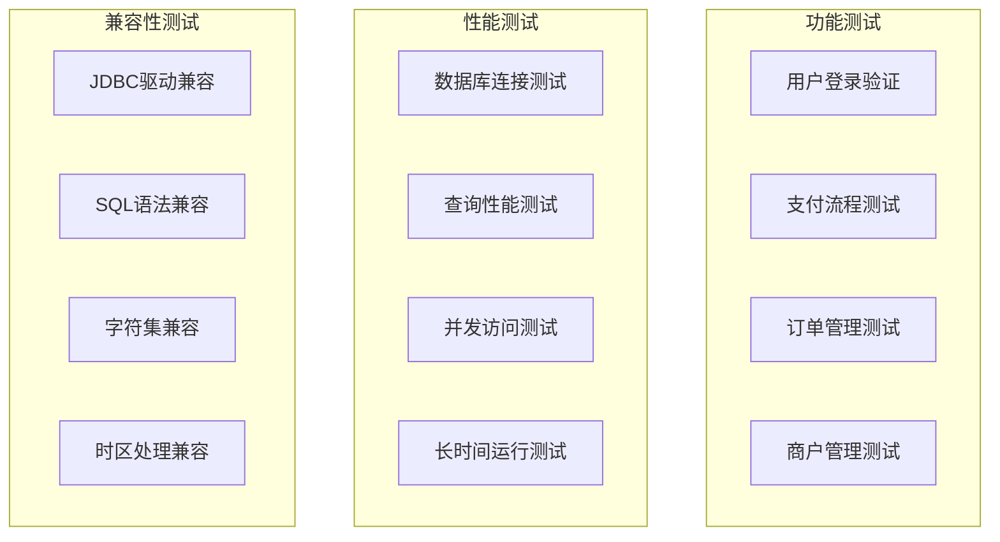

# Jeepay 支付系统 MySQL 版本升级设计文档

## 概述

本文档描述了 Jeepay 支付系统中 MySQL 数据库从当前版本（8.0.25）升级到最新稳定版本（8.0.35+）的设计方案。该升级旨在提升系统的性能、安全性和稳定性。

### 升级目标
- 将 MySQL 版本从 8.0.25 升级至 8.0.35+（当前最新稳定版本）
- 保证业务连续性和数据完整性
- 提升数据库性能和安全性
- 优化现有配置以适配新版本特性

### 当前环境分析

| 组件 | 当前版本 | 目标版本 | 部署方式 |
|------|----------|----------|----------|
| MySQL Server | 8.0.25 | 8.0.35+ | Docker 容器 |
| MySQL Connector/J | 8.0.28 | 8.0.35+ | Maven 依赖 |
| Spring Boot | 2.4.8 | 保持不变 | - |
| Druid 连接池 | 默认版本 | 保持不变 | - |

## 系统架构影响分析

### 数据库连接架构



### 受影响的系统组件

| 系统模块 | 配置文件路径 | 影响程度 | 备注 |
|----------|-------------|----------|------|
| 运营平台 | conf/manager/application.yml | 低 | 仅需更新连接配置 |
| 商户平台 | conf/merchant/application.yml | 低 | 仅需更新连接配置 |
| 支付网关 | conf/payment/application.yml | 低 | 仅需更新连接配置 |
| 开发环境 | conf/devCommons/config/application.yml | 低 | 仅需更新连接配置 |
| Docker 部署 | docker-compose.yml | 中 | 需更新镜像版本 |
| 代码生成器 | jeepay-z-codegen | 中 | 需更新驱动版本 |

## 升级策略设计

### 版本兼容性评估

#### MySQL 8.0.25 → 8.0.35+ 兼容性分析

| 特性类别 | 兼容性状态 | 说明 |
|----------|------------|------|
| SQL 语法 | 完全兼容 | 无破坏性变更 |
| 数据类型 | 完全兼容 | 支持所有现有类型 |
| 索引结构 | 完全兼容 | 无需重建索引 |
| 存储引擎 | 完全兼容 | InnoDB 保持兼容 |
| 字符集支持 | 完全兼容 | utf8mb4 支持增强 |
| 连接协议 | 完全兼容 | 认证方式保持一致 |

#### Spring Boot 2.4.8 兼容性

| 依赖组件 | 当前版本 | 兼容状态 | 建议操作 |
|----------|----------|----------|----------|
| MySQL Connector/J | 8.0.28 | 兼容但建议升级 | 升级至 8.0.35 |
| Druid | 默认版本 | 完全兼容 | 保持不变 |
| MyBatis Plus | 3.4.2 | 完全兼容 | 保持不变 |
| HikariCP | Spring Boot 默认 | 完全兼容 | 保持不变 |

### 升级实施方案

#### 方案一：原地升级（推荐用于开发/测试环境）



#### 方案二：蓝绿部署（推荐用于生产环境）



## 升级流程设计

### 前置准备阶段

#### 环境评估清单

| 检查项 | 验证方法 | 预期结果 |
|--------|----------|----------|
| 数据库版本 | `SELECT VERSION()` | 确认当前为 8.0.25 |
| 数据库大小 | `SELECT SUM(data_length + index_length) FROM information_schema.tables` | 记录当前容量 |
| 表结构完整性 | `CHECK TABLE` 所有表 | 确保无损坏 |
| 索引状态 | `SHOW INDEX` 验证 | 确保索引正常 |
| 连接池配置 | 检查 Druid 配置 | 确认连接参数 |
| 应用依赖 | 检查 Maven 依赖 | 确认兼容性 |

#### 备份策略

| 备份类型 | 备份方法 | 存储位置 | 保留期限 |
|----------|----------|----------|----------|
| 数据备份 | mysqldump 全量备份 | 外部存储卷 | 30天 |
| 配置备份 | 配置文件复制 | 版本控制系统 | 永久 |
| Docker卷备份 | 数据卷快照 | Docker宿主机 | 7天 |
| 业务数据验证 | 关键表记录数统计 | 监控系统 | 7天 |

### 升级执行阶段

#### 数据库升级步骤



#### 配置更新清单

| 配置文件 | 更新内容 | 示例配置 |
|----------|----------|----------|
| docker-compose.yml | MySQL镜像版本 | `mysql:8.0.35` |
| pom.xml | MySQL连接器版本 | `<mysql.version>8.0.35</mysql.version>` |
| application.yml | 连接URL优化 | 添加新版本特性参数 |
| my.cnf | 性能配置优化 | 利用新版本性能特性 |

### 验证测试阶段

#### 功能验证矩阵

| 测试类别 | 测试项目 | 验证方法 | 通过标准 |
|----------|----------|----------|----------|
| 连接测试 | 数据库连接 | 应用启动日志 | 无连接错误 |
| 基础功能 | CRUD操作 | 执行基本业务流程 | 操作正常 |
| 事务测试 | 事务完整性 | 支付流程测试 | 事务一致性 |
| 性能测试 | 查询响应时间 | 关键查询性能 | 不降低于升级前 |
| 并发测试 | 高并发场景 | 压力测试 | 系统稳定运行 |
| 数据一致性 | 数据完整性 | 数据校验脚本 | 数据无丢失 |

#### 回滚准备

| 回滚场景 | 触发条件 | 回滚步骤 | 预期时间 |
|----------|----------|----------|----------|
| 升级失败 | 容器启动失败 | 恢复旧版本镜像 | 5分钟 |
| 性能降级 | 响应时间增加>20% | 数据回滚+版本回退 | 15分钟 |
| 功能异常 | 关键业务流程中断 | 完整环境回滚 | 30分钟 |
| 数据异常 | 数据不一致 | 从备份恢复 | 1小时 |

## 性能优化设计

### MySQL 8.0.35+ 新特性利用

#### 性能增强特性

| 特性名称 | 描述 | 在Jeepay中的应用 |
|----------|------|------------------|
| 改进的成本优化器 | 更精确的查询执行计划 | 优化支付订单查询性能 |
| 增强的索引选择 | 更智能的索引使用策略 | 提升商户信息检索效率 |
| 改进的并行查询 | 更好的多核CPU利用 | 加速大数据量统计查询 |
| 优化的内存管理 | 减少内存碎片 | 提升高并发场景稳定性 |

#### 配置优化建议



### 连接池优化

#### Druid 连接池配置优化

| 参数名称 | 当前值 | 优化建议值 | 优化理由 |
|----------|--------|------------|----------|
| initial-size | 5 | 10 | 减少启动时连接建立延迟 |
| min-idle | 5 | 10 | 保证最小可用连接数 |
| max-active | 30 | 50 | 支持更高并发 |
| max-wait | 60000 | 30000 | 快速失败，避免长时间等待 |
| validation-query-timeout | 默认 | 5000 | 防止验证查询超时 |
| test-on-borrow | false | false | 保持当前配置，避免性能影响 |
| test-while-idle | true | true | 保持连接有效性检查 |

## 安全性增强设计

### 身份认证升级

#### 认证插件迁移策略

| 认证方式 | 当前状态 | 升级后 | 迁移策略 |
|----------|----------|--------|----------|
| mysql_native_password | 使用中 | 兼容保留 | 渐进式迁移 |
| caching_sha2_password | 未使用 | 推荐使用 | 新用户采用 |
| SSL连接 | 可选 | 强制启用 | 生产环境必须 |

#### 权限管理优化



### 网络安全强化

#### 连接安全配置

| 安全特性 | 配置项 | 建议值 | 说明 |
|----------|--------|--------|------|
| SSL加密 | require_secure_transport | ON | 强制SSL连接 |
| IP白名单 | bind-address | 指定IP | 限制访问来源 |
| 连接超时 | wait_timeout | 300 | 防止僵尸连接 |
| 最大连接错误 | max_connect_errors | 10 | 防止暴力破解 |

## 监控与运维设计

### 升级过程监控

#### 关键指标监控



#### 告警策略配置

| 监控项 | 告警阈值 | 告警级别 | 处理策略 |
|--------|----------|----------|----------|
| 数据库连接失败率 | >1% | 严重 | 立即介入 |
| 查询响应时间 | >1000ms | 警告 | 性能分析 |
| 连接池使用率 | >80% | 警告 | 扩容准备 |
| 磁盘空间使用 | >85% | 警告 | 清理日志 |
| 内存使用率 | >90% | 严重 | 重启服务 |

### 运维操作规范

#### 日常维护流程



#### 应急响应预案

| 故障类型 | 检测方式 | 应急措施 | 恢复时间 |
|----------|----------|----------|----------|
| 数据库无法连接 | 连接监控 | 重启容器/切换备库 | 5分钟 |
| 性能急剧下降 | 响应时间监控 | 查杀慢查询/重启服务 | 10分钟 |
| 数据损坏 | 数据校验 | 从备份恢复 | 30分钟 |
| 磁盘空间不足 | 空间监控 | 清理日志/扩容 | 15分钟 |

## 风险评估与控制

### 升级风险矩阵

| 风险类型 | 发生概率 | 影响程度 | 风险等级 | 控制措施 |
|----------|----------|----------|----------|----------|
| 数据丢失 | 低 | 高 | 中风险 | 多重备份策略 |
| 性能下降 | 中 | 中 | 中风险 | 性能基线对比 |
| 服务中断 | 中 | 高 | 高风险 | 蓝绿部署策略 |
| 兼容性问题 | 低 | 中 | 低风险 | 充分测试验证 |
| 配置错误 | 中 | 中 | 中风险 | 配置审查机制 |

### 回滚决策标准

#### 回滚触发条件

```mermaid
decision_tree
graph TD
    A[升级完成] --> B{功能验证通过?}
    B -->|否| C[立即回滚]
    B -->|是| D{性能指标正常?}
    D -->|否| E{性能下降>20%?}
    E -->|是| F[执行回滚]
    E -->|否| G[持续观察24小时]
    D -->|是| H{业务指标正常?}
    H -->|否| I[定位问题]
    H -->|是| J[升级成功]
    G --> K{观察期内稳定?}
    K -->|否| F
    K -->|是| J
    I --> L{问题可快速解决?}
    L -->|否| F
    L -->|是| M[问题修复]
    M --> H
```

### 应急预案

#### 快速回滚流程

| 步骤 | 操作内容 | 预期时间 | 责任人 |
|------|----------|----------|--------|
| 1 | 确认回滚决策 | 2分钟 | 技术负责人 |
| 2 | 停止应用服务 | 1分钟 | 运维人员 |
| 3 | 切换到备份实例 | 5分钟 | 数据库管理员 |
| 4 | 恢复应用配置 | 3分钟 | 运维人员 |
| 5 | 重启应用服务 | 5分钟 | 运维人员 |
| 6 | 验证系统功能 | 10分钟 | 测试人员 |
| 7 | 通知相关人员 | 2分钟 | 项目经理 |

## 测试策略

### 升级前测试

#### 测试环境准备

| 环境类型 | 配置要求 | 数据准备 | 测试范围 |
|----------|----------|----------|----------|
| 开发环境 | 最小配置 | 基础测试数据 | 功能验证 |
| 测试环境 | 生产环境50% | 脱敏生产数据 | 全面测试 |
| 预生产环境 | 生产环境同配置 | 生产数据副本 | 压力测试 |

#### 测试用例设计



### 生产环境验证

#### 灰度发布策略

| 阶段 | 流量比例 | 持续时间 | 验证内容 |
|------|----------|----------|----------|
| 第一阶段 | 5% | 2小时 | 基础功能验证 |
| 第二阶段 | 25% | 6小时 | 性能指标验证 |
| 第三阶段 | 50% | 12小时 | 稳定性验证 |
| 第四阶段 | 100% | 持续监控 | 全量验证 |
