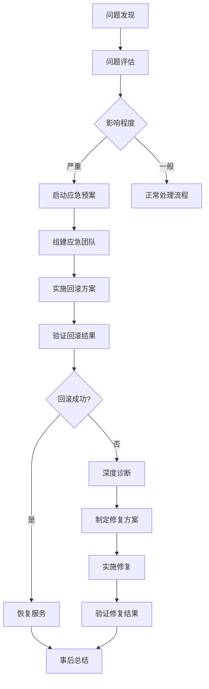

# Jeepay JDK 17 升级回滚方案和应急预案

## 1. 回滚方案总览

### 1.1 回滚触发条件

以下情况需要考虑回滚：

| 紧急程度 | 触发条件 | 响应时间 | 决策层级 |
|----------|----------|----------|----------|
| P0 | 系统完全不可用 | 立即 | 技术负责人 |
| P1 | 核心功能异常，影响业务 | 5分钟 | 技术负责人 + 业务负责人 |
| P2 | 性能显著下降（>50%） | 15分钟 | 技术团队 |
| P3 | 非核心功能异常 | 1小时 | 开发团队 |

### 1.2 回滚决策矩阵

| 问题类型 | 修复时间评估 | 业务影响 | 建议处理方式 |
|----------|-------------|----------|-------------|
| 编译错误 | > 30分钟 | 高 | 立即回滚 |
| 运行时异常 | > 15分钟 | 高 | 立即回滚 |
| 性能问题 | > 1小时 | 中 | 计划回滚 |
| 兼容性问题 | > 2小时 | 中 | 分模块回滚 |
| 监控异常 | < 30分钟 | 低 | 问题修复 |

## 2. 快速回滚流程

### 2.1 立即回滚（5分钟内完成）

#### 步骤1：停止JDK 17服务
```bash
# 停止所有JDK 17服务
docker-compose down

# 确认服务已停止
docker ps | grep jeepay
```

#### 步骤2：切换到JDK 8配置
```bash
# 方案A：使用Git分支切换
cd /data/workspace/jeepay
git stash  # 保存当前更改
git checkout jdk8-backup-branch  # 切换到JDK 8备份分支

# 方案B：使用备份文件
cp -r /backup/jeepay-jdk8/* /data/workspace/jeepay/
```

#### 步骤3：启动JDK 8服务
```bash
# 使用原有配置启动
docker-compose up -d

# 检查服务状态
docker-compose ps
docker-compose logs --tail=50 payment
```

#### 步骤4：验证回滚结果
```bash
# 健康检查
curl http://localhost:9216/actuator/health
curl http://localhost:9217/actuator/health  
curl http://localhost:9218/actuator/health

# 功能验证
curl -X POST http://localhost:9216/api/test
```

### 2.2 分模块回滚

当只有特定模块出现问题时，可以进行分模块回滚：

```bash
# 只回滚支付模块
docker-compose stop payment
docker run -d --name jeepay-payment-jdk8 \
  --network jeepay_jeepay \
  -p 9216:9216 \
  jeepay-payment:jdk8-backup

# 只回滚管理模块
docker-compose stop manager
docker run -d --name jeepay-manager-jdk8 \
  --network jeepay_jeepay \
  -p 9217:9217 \
  jeepay-manager:jdk8-backup
```

## 3. 数据回滚策略

### 3.1 数据库回滚

#### 场景1：数据结构兼容，仅应用回滚
```sql
-- 检查数据一致性
SELECT COUNT(*) FROM pay_order WHERE create_time > 'UPGRADE_START_TIME';

-- 必要时清理升级期间的异常数据
DELETE FROM sys_log WHERE create_time > 'UPGRADE_START_TIME' AND log_type = 'ERROR';
```

#### 场景2：数据结构不兼容，需要数据库回滚
```bash
# 停止应用服务
docker-compose down

# 恢复数据库备份
mysql -u root -p jeepaydb < /backup/jeepaydb_pre_upgrade.sql

# 确认数据恢复
mysql -u root -p -e "SELECT COUNT(*) FROM jeepaydb.pay_order;"
```

### 3.2 Redis缓存处理

```bash
# 清理可能不兼容的缓存数据
redis-cli FLUSHDB

# 或选择性清理
redis-cli DEL "jeepay:*:jdk17"
redis-cli DEL "jeepay:config:*"
```

### 3.3 文件系统回滚

```bash
# 恢复配置文件
cp -r /backup/conf/* /data/workspace/jeepay/conf/

# 恢复日志配置
cp /backup/logback-spring.xml /data/workspace/jeepay/src/main/resources/
```

## 4. 应急预案

### 4.1 应急响应团队

| 角色 | 姓名 | 电话 | 邮箱 | 职责 |
|------|------|------|------|------|
| 应急指挥官 | [技术负责人] | [手机] | [邮箱] | 总体决策、资源协调 |
| 技术专家 | [高级工程师] | [手机] | [邮箱] | 技术问题诊断和解决 |
| 运维专家 | [运维负责人] | [手机] | [邮箱] | 系统部署和监控 |
| 业务专家 | [业务负责人] | [手机] | [邮箱] | 业务影响评估 |
| 沟通协调员 | [项目经理] | [手机] | [邮箱] | 内外部沟通协调 |

### 4.2 应急响应流程



### 4.3 分级响应机制

#### P0级响应（系统完全不可用）

**响应时间：立即（5分钟内）**

1. **立即行动**
   - 技术负责人立即响应
   - 启动应急通讯群
   - 实施快速回滚

2. **沟通机制**
   ```
   立即通知：
   - 业务负责人
   - 运维团队
   - 客服团队
   
   通知内容：
   - 问题描述
   - 影响范围
   - 预期恢复时间
   ```

3. **执行检查单**
   - [ ] 确认问题影响范围
   - [ ] 执行立即回滚流程
   - [ ] 验证回滚结果
   - [ ] 通知相关方恢复情况

#### P1级响应（核心功能异常）

**响应时间：15分钟内**

1. **问题诊断**
   - 收集错误日志
   - 分析监控数据
   - 评估修复时间

2. **决策流程**
   - 技术评估：修复时间 vs 回滚时间
   - 业务评估：业务影响程度
   - 最终决策：修复 or 回滚

#### P2级响应（性能问题）

**响应时间：1小时内**

1. **性能分析**
   - JVM性能分析
   - 数据库性能分析
   - 网络性能分析

2. **优化措施**
   - JVM参数调优
   - SQL查询优化
   - 缓存策略调整

## 5. 监控和告警

### 5.1 关键监控指标

```yaml
# 应用监控
application_metrics:
  - name: "服务可用性"
    threshold: "< 99%"
    action: "立即告警"
  
  - name: "响应时间"
    threshold: "> 2000ms"
    action: "告警通知"
    
  - name: "错误率"
    threshold: "> 1%"
    action: "告警通知"

# 系统监控  
system_metrics:
  - name: "CPU使用率"
    threshold: "> 80%"
    action: "告警通知"
    
  - name: "内存使用率"
    threshold: "> 85%"
    action: "立即告警"
    
  - name: "GC暂停时间"
    threshold: "> 500ms"
    action: "告警通知"
```

### 5.2 告警配置

```bash
# Prometheus告警规则示例
groups:
- name: jeepay-jdk17-upgrade
  rules:
  - alert: ApplicationDown
    expr: up{job="jeepay"} == 0
    for: 1m
    labels:
      severity: critical
    annotations:
      summary: "Jeepay application is down"
      
  - alert: HighGCTime  
    expr: jvm_gc_collection_seconds{quantile="0.99"} > 0.5
    for: 5m
    labels:
      severity: warning
    annotations:
      summary: "High GC pause time detected"
```

## 6. 通讯模板

### 6.1 回滚通知模板

```
标题：【紧急】Jeepay JDK17升级回滚通知

各位同事：

由于在JDK17升级过程中发现[具体问题]，为确保业务稳定运行，
技术团队决定执行回滚操作。

回滚详情：
- 开始时间：[时间]
- 预计完成：[时间]  
- 影响范围：[范围]
- 回滚原因：[原因]

请各业务团队注意：
1. 回滚期间可能出现短暂服务中断
2. 请暂停相关业务操作
3. 如有紧急业务需求，请联系[联系人]

技术团队
[时间]
```

### 6.2 回滚完成通知

```
标题：【通知】Jeepay系统回滚完成

各位同事：

Jeepay系统JDK17升级回滚操作已完成，服务已恢复正常。

回滚结果：
- 完成时间：[时间]
- 服务状态：正常
- 功能验证：通过
- 数据完整性：确认无误

业务恢复：
- 所有核心功能已恢复
- 数据服务正常
- 可以正常进行业务操作

后续安排：
1. 技术团队将分析回滚原因
2. 制定改进方案
3. 择期重新进行升级

感谢大家的配合！

技术团队
[时间]
```

## 7. 事后分析

### 7.1 回滚总结模板

```markdown
# JDK17升级回滚事后分析报告

## 基本信息
- 升级开始时间：
- 问题发现时间：
- 回滚开始时间：
- 回滚完成时间：
- 总影响时长：

## 问题分析
### 问题描述
[详细描述遇到的问题]

### 根本原因
[分析问题的根本原因]

### 影响评估
- 业务影响：
- 用户影响：
- 数据影响：

## 处理过程
### 决策过程
[记录决策过程和考虑因素]

### 执行过程
[记录具体执行步骤]

### 遇到的困难
[记录处理过程中的困难]

## 改进建议
### 技术改进
[技术方面的改进建议]

### 流程改进
[流程方面的改进建议]

### 工具改进
[工具方面的改进建议]

## 下次升级计划
[制定下次升级的改进计划]
```

### 7.2 经验教训总结

1. **预防措施**
   - 加强测试覆盖率
   - 完善回滚流程
   - 优化监控告警

2. **响应优化**
   - 缩短问题发现时间
   - 提高回滚效率
   - 改进沟通机制

3. **工具建设**
   - 自动化回滚脚本
   - 一键部署工具
   - 实时监控大屏

## 8. 备份和恢复验证

### 8.1 备份验证清单

- [ ] 代码仓库备份完整性
- [ ] 数据库备份可用性
- [ ] 配置文件备份准确性
- [ ] Docker镜像备份有效性
- [ ] 回滚脚本功能验证

### 8.2 恢复演练

建议定期进行回滚演练：

```bash
# 演练脚本示例
#!/bin/bash
echo "开始JDK17升级回滚演练"

# 1. 备份当前状态
echo "1. 备份当前状态..."
docker-compose down
cp -r /data/workspace/jeepay /backup/drill/$(date +%Y%m%d_%H%M%S)

# 2. 模拟升级状态
echo "2. 模拟升级状态..."
# [升级操作]

# 3. 执行回滚
echo "3. 执行回滚..."
# [回滚操作]

# 4. 验证结果
echo "4. 验证回滚结果..."
# [验证脚本]

echo "回滚演练完成"
```

通过定期演练确保回滚方案的有效性和团队的熟练度。